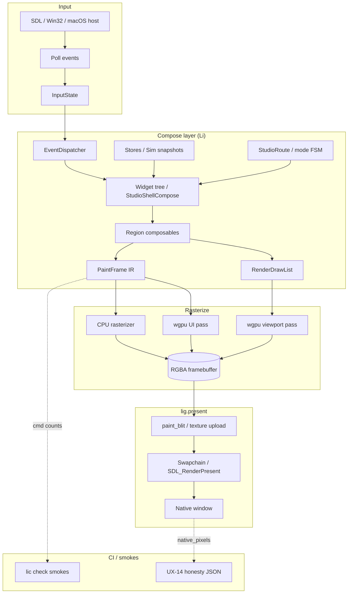

# Li GUI Library Plan

A detailed roadmap for building a **production-grade, Li-native GUI library** in the Li ecosystem — reactive, typed, proof-friendly — learning from Qt, Svelte, and Next.js without embedding them.

Related docs: [NATIVE-WINDOW.md](NATIVE-WINDOW.md), [WORLD-STUDIO-MASTER-PLAN.md](game-dev/WORLD-STUDIO-MASTER-PLAN.md), [studio-design-tokens.toml](design/studio-design-tokens.toml).

---

## Executive summary

**What we are building.** A first-class GUI stack for Li World Studio and future Li applications: a compile-to-native UI framework where layout, state, and paint are expressed in Li, verified with `requires`/`ensures`, and rasterized through a stable **PaintCmd intermediate representation (IR)**. The shell is already sketched as `StudioShellCompose` — dock, outliner, viewport, timeline, inspector, agent strip, command palette — but today it renders as a **low-fidelity wireframe** (colored rectangles and grid lines) via CPU `paint_blit` or a mirrored C host (`studio_shell_paint_fb.c`). This plan turns that scaffold into a real product UI.

**Why Li-native, not Qt or React.**

| Approach | Why we reject it for Studio |
|----------|----------------------------|
| **Embed Qt** | Brings MOC, QObject heap churn, C++ ABI coupling, and a second object model that fights Li's proof contracts. Qt's layout and signal patterns are worth *learning*, not importing. |
| **Embed React/Electron** | Web stack adds SSR/hydration complexity, non-deterministic layout, and breaks the "one native binary" ship path. Marketing HTML mocks already exist; they must never become product truth. |
| **Li-native GUI** | Matches compile-to-native, deterministic sim stepping, MCP agent loops, and `lic check` smokes. PaintCmd counts, panel-switch budgets, and `native_pixels` honesty flags become CI gates — something neither Qt nor React offers out of the box. |

**Strategic bet.** Extend **`li-ui`** (tokens, layout IR, PaintCmd), **`li-gui`** (input, viewport, widget core), and **`li-render`/`lig`** (GPU viewport + future UI rasterizer) incrementally. Retire the duplicated C paint mirror once Li owns the full present loop. Keep Path B (CPU `paint_blit`) honest for CI until Path A (wgpu swapchain) lands per WP-GD-05.

---

## Lessons from Qt (apply to Li)

Qt has forty years of desktop GUI wisdom. We take the architecture, not the runtime.

### Object model and signals/slots → Li equivalent

Qt's `QObject` tree plus signals/slots decouple producers from consumers. Li already has a cleaner substitute:

| Qt | Li today | Li target |
|----|----------|-----------|
| `QObject::connect` | Typed action enums (`studio_key_action_*`, palette actions) | **`Signal<T>`** store writes + **`Slot`** handlers registered at compose time |
| Property notify | Manual field updates on `StudioShellCompose` | Compiler-tracked **`Store<T>`** with dependency edges |
| Event filters | `gui_handle_studio_key`, `studio_shell_handle_*_pointer` | Central **`EventDispatcher`** with capture/bubble phases on widget tree |

**Apply:** Keep signals as **pure functions returning action IDs**, not callbacks. Handlers live in `studio/src/lib.li` or vertical packages; smokes assert transition legality. Avoid Qt-style stringly signal names.

### Widget hierarchy and layout managers

Qt widgets form a parent/child tree; `QBoxLayout`, `QGridLayout`, and `QFormLayout` compute geometry.

Li already has the seed:

- **Shell layout:** `layout_studio_shell_adaptive`, `layout_studio_shell_drug_litl` in `li-ui`
- **Compose tree:** `StudioShellCompose` aggregates region composables (`StudioDockCompose`, `StudioTimelineCompose`, …)
- **Paint tree:** `studio_paint_shell_chrome` walks compose and emits PaintCmds

**Apply:** Introduce a generic **`Widget` trait** (or structural protocol) in `li-gui`:

```
Widget
  measure(constraints) -> Size
  layout(size) -> LayoutResult   # child positions
  paint(frame, layout) -> unit
  handle_event(event) -> EventResult
```

Shell regions become widgets; `QBoxLayout` maps to **`FlexLayout`** (row/column, gap, align); `QGridLayout` maps to **`GridLayout`** for inspector field rows. Adaptive drug/LITL inspector widening stays a layout policy parameter, not a special case.

### Model/View (QAbstractItemModel)

Qt separates data from presentation — critical for outliner, timeline, and inspector lists.

**Apply:**

| View | Model (Li) | View (compose + paint) |
|------|------------|------------------------|
| Outliner | `SceneGraphModel` — entity IDs, names, hierarchy | `studio_compose_outliner` |
| Timeline | `TimelineModel` — tracks, keyframes, playhead | `studio_compose_timeline` |
| Inspector | `SelectionModel` + typed field descriptors | `studio_compose_inspector_*` |
| Command palette | `PaletteModel` — fuzzy-filtered actions | `StudioCommandPaletteCompose` |

Models are **plain Li structs** updated by sim/agent hooks; views are **pure functions** `(model, layout) -> Compose`. Diff-based invalidation (only repaint changed regions) comes in Phase 2.

### Stylesheets vs palette tokens

Qt Style Sheets (QSS) are runtime string CSS on widgets. Li already chose the better path: **`studio-design-tokens.toml`** is the source of truth; `li-ui` exposes `studio_color_*()` accessors verified by `studio-ui-ux-verify-tokens.py`.

**Apply:** Treat tokens as **compile-time constants**, not runtime QSS parsing. Add semantic roles (`text_primary`, `text_muted`, `surface_elevated`, `danger`, `success`) and component recipes (`Button.primary`, `Input.default`). Phase 0 expands typography and spacing tokens; Phase 1 binds them to widget defaults.

### Scene graph / QPainter → PaintCmd IR

Qt's `QPainter` records draw calls; modern Qt Quick uses a scene graph. Li's **`PaintCmd`** (`fill_rect`, `stroke_rect`, `viewport_grid`) is the IR — intentionally minimal.

**Apply:** Extend PaintCmd opcodes incrementally:

| Phase | New ops | Purpose |
|-------|---------|---------|
| 0 | `fill_round_rect`, `stroke_round_rect` | Chrome polish |
| 1 | `clip_rect`, `push_clip`/`pop_clip` | Scroll regions |
| 3 | `draw_glyphs`, `draw_image`, `draw_path` | Text and icons |
| 3 | `layer_blur` (optional) | Palette backdrop |

Keep IR **backend-agnostic**: CPU rasterizer first, wgpu UI pass later. Viewport 3D stays in `li-render` draw lists (separate layer).

### Event loop integration

Qt owns the main loop: `exec()` → dispatch → repaint. Li's present loop is split across **`lig.present`**, SDL host, and `li-studio-demo` ticks.

**Apply:** Define a single **`GuiFrame` contract**:

1. Poll input → `InputState`
2. Dispatch events on widget tree
3. Run reactive store flushes (dirty compose subtrees)
4. Compose → `PaintFrame` + viewport `RenderDrawList`
5. Rasterize → present via `lig_present_blit_*` or wgpu

Studio's `studio_vertical_demo_compose` tick becomes the reference loop; smokes gate frame time and cmd counts.

### What to skip

- **MOC / meta-object compiler** — Li's compiler should emit reactivity, not a preprocessor
- **QObject parent-owned heap churn** — prefer stack structs and arena allocation for compose trees
- **QWidget paintDevice abstraction over everything** — keep 3D viewport on wgpu, 2D chrome on PaintCmd
- **Qt Widgets theme engine** — tokens + component styles suffice

---

## Lessons from Svelte (apply to Li)

Svelte proves that **compile-time reactivity** beats runtime VDOM for performance and predictability — aligned with Li's compile-to-native model.

### Compile-time reactivity (stores, `$:` derived)

Svelte stores (`writable`, `derived`) and `$:` statements compile to subscription wiring. Li can do better with **proofs**:

```li
# Conceptual target (Phase 2)
store SimTick: int
derived TimelinePlayhead: float from SimTick, TimelineModel
# compiler emits: re-compose timeline only when SimTick or model changes
```

**Apply today:** `StudioShellCompose` fields are manually updated (`studio_agent_sync_chrome_from_run`, `studio_shell_apply_mode`). Smokes already enforce paint cmd counts per state — that is manual invalidation. Phase 2 adds **`@compose`** proc annotations or a `li-gui-macros` package that records field dependencies and emits diff scopes.

### Component composition, props, slots

Svelte components accept props and expose slots for children. Li composables (`studio_compose_agent_chrome`, `studio_compose_inspector_selected`) are already components without the syntax sugar.

**Apply:** Standardize on:

- **Props** — function parameters with `requires`/`ensures`
- **Slots** — optional `Compose` parameters (e.g. inspector body varies by profile)
- **Snippets** — named compose helpers per vertical (`studio_compose_shell_drug_litl`)

Document component contracts in package READMEs; smokes per component.

### Minimal runtime — fits Li compile-to-native

Svelte 5 runes reduce runtime overhead. Li should have **zero VDOM, zero GC-heavy scene diff**. Compose procs allocate structs on the stack; paint emits a flat cmd buffer.

**Apply:** Reactive stores (Phase 2) compile to **invalidation bitsets**, not observer linked lists at runtime. Target: compose cost \< 1 ms for shell at 1080p on bench hardware (see `panel_switch_ms_max = 100` token).

### Transitions/animations as declarative

Svelte transitions (`fade`, `fly`) are declarative with CSS/easing. Li has **`studio_panel_transition_ms`** and panel switch timing in `gui_panel_switch_timing`.

**Apply:** Add **`MotionSpec`** tokens (duration, easing enum) and PaintCmd **`interpolate_*`** for layout morphs (inspector width LITL stages, palette open). Keep animations **opt-in per widget**; default to instant for CI determinism unless `STUDIO_MOTION=1`.

### How the Li compiler could track dependencies in compose procs

Concrete compiler strategy (Phase 2 spike):

1. Parse `compose` procs that read `var state: ShellState` fields
2. Build a dependency graph: field writes → downstream compose procs
3. Emit a **`ComposePlan`** static table for the demo binary
4. At tick: set dirty flags from changed stores; run only affected compose procs
5. Verify: `ensures` on paint cmd counts still hold per dirty scope

This mirrors Svelte's `$:` but remains **checkable** — if a dependency is missed, smoke cmd counts fail.

---

## Lessons from Next.js (apply to Li)

Next.js solves routing, layouts, and server/client boundaries for web apps. Studio is not a website, but the **composition patterns** transfer.

### File-based routing → studio panel routes?

Next.js maps `app/dashboard/settings/page.tsx` to URLs. Studio maps **modes and profiles** to panel prominence.

**Apply:** Introduce **`StudioRoute`** — not HTTP routes, but **named shell configurations**:

| Route key | Layout variant | Primary panels |
|-----------|----------------|----------------|
| `author/game` | default shell | outliner + viewport + inspector |
| `simulate/scientific` | sim HUD emphasis | viewport + timeline |
| `adaptive/drug/litl-2` | widened inspector | DFT panels |
| `agent` | expanded agent strip | tool trace |
| `bench` | metrics HUD | honesty badges |

Routes live in `studio.toml` or env (`STUDIO_DEMO_PROFILE`); `studio_shell_apply_mode` + `studio_shell_apply_adaptive_panel_set` are the handlers. Phase 4 formalizes a **`studio_route_table`** consulted at startup.

### Server/client boundaries → sim vs UI thread

Next.js separates Server Components (data fetch) from Client Components (interaction). Studio separates **sim stepping** from **UI compose/paint**.

**Apply:**

| "Server" (sim thread) | "Client" (UI thread) |
|-----------------------|----------------------|
| `sim_step`, physics tiers, RL rollouts | compose, paint, input dispatch |
| Deterministic tick counter | playhead display, HUD |
| Checkpoint snapshots | timeline scrub UI |

Cross-boundary data flows through **immutable snapshots** (`SimSessionStub`, `StudioWorldCheckpoint`) copied once per frame — never share mutable sim state with compose procs. This matches Next's serializable props pattern.

### Layouts nested layouts → shell regions

Next.js `layout.tsx` nests: root → dashboard → settings. Studio shell already nests regions inside `layout_studio_shell_adaptive`.

**Apply:** Extract **`ShellLayout`** (persistent chrome) from **`RouteLayout`** (mode-specific panel visibility) from **`PanelLayout`** (widget internals). Drug LITL adaptive widening becomes a **`RouteLayout`** override, not a fork of shell compose.

### SSR/hydration analog → compose once, paint many frames

Next.js renders HTML on the server, hydrates on the client. Studio analog:

| Next.js | Li Studio |
|---------|-----------|
| SSR HTML | **`studio_compose_shell_*`** — compute layout rects, labels, visibility |
| Hydration | First paint attaches to rasterizer |
| Client re-render | **Re-compose only dirty subtrees**; paint every frame |

Expensive compose (IO, asset probes) runs on **tick or event**, not every vsync. Cheap paint runs every frame (HUD fps counter). `studio_attach_viewport_shell` already separates viewport error probe (IO) from paint.

### App router patterns for studio modes (verticals)

Next.js App Router groups routes by domain (`(marketing)`, `(app)`). Studio verticals (game, sim_rl, sim_drug_design, …) share one binary.

**Apply:** **`VerticalModule`** interface:

```
vertical_id -> profile paint tag, default route, inspector fields, sim hook, agent tool allowlist
```

Seven profiles in `shell_profile_find` / `studio_profile_*` become registered verticals. New vertical = new module + smokes, not a fork of the shell.

---

## Current Li stack audit

### What exists

| Layer | Package / path | Status |
|-------|----------------|--------|
| **Design tokens** | `studio/docs/design/studio-design-tokens.toml` → `li-ui` `studio_color_*` | Landed; verified by Python script |
| **Layout IR** | `li-ui`: `StudioShellLayout`, `layout_studio_shell_adaptive`, `layout_studio_shell_drug_litl` | Production-quality rect math |
| **PaintCmd IR** | `li-ui`: `PaintFrame`, `PaintCmd`, `paint_op_fill/stroke/viewport_grid` | Minimal op set; cmd counts in smokes |
| **Input model** | `li-ui`: `InputState`; `li-gui`: keyboard routing, palette | Partial — pointer, escape, cmd+k, digits 1–5 |
| **Viewport** | `li-gui`: `ViewportRegion`, selection, panel switch timing | Landed |
| **Shell compose** | `studio/src/lib.li`: `StudioShellCompose`, region composables, mode FSM | Rich; 6000+ lines |
| **Shell paint** | `studio_paint_shell_chrome`, region painters (dock, timeline, inspector, agent) | Wireframe quality |
| **C paint mirror** | `deploy/studio-demo/native/studio_shell_paint_fb.c` | Duplicates Li layout; used by SDL host |
| **SDL present host** | `studio_shell_present_host.c` | Real window; CPU RGB blit |
| **Present bridge** | `lig.present`: blit, wgpu readback/draw-list stubs, `native_pixels` source enum | Contracts landed; GPU pixels stubbed |
| **Viewport render** | `li-render`: FPS counter, `RenderDrawList`, wgpu smoke/probes | Scaffold; no swapchain pixels |
| **Honesty** | `native_pixels`, `lig_native_pixel_source_honest_product`, HUD badges | Landed per UX-14 |
| **Smokes** | `li-ui`, `li-gui`, `li-studio`, `studio/li-tests` | Extensive cmd-count and journey tests |

### Gaps

| Gap | Impact | Phase |
|-----|--------|-------|
| **No text rendering** | Labels are colored rects; unusable product UI | 0–3 |
| **No widget library** | Every control is bespoke compose/paint | 1 |
| **No flex/grid layout engine** | Only shell adaptive layout | 1 |
| **No focus/tab order model** | Focus ring exists; no roving tabindex | 1 |
| **No scroll/clipping** | Inspector lists cannot scroll | 1 |
| **Reactive stores not compiled** | Manual sync (`studio_agent_sync_chrome_from_run`) | 2 |
| **PaintCmd → pixel gap** | Li emits counts; C host paints pixels (two implementations) | 4 |
| **wgpu UI path** | Viewport draw-list stub only; chrome entirely CPU | 3 |
| **Texture/icon atlas** | No asset pipeline for UI glyphs | 3 |
| **Accessibility** | Contrast stub; no screen reader bridge | 1+ |
| **Platform hosts** | SDL/WSL-focused; macOS/Windows native loops incomplete | 5 |

### Architecture tension to resolve

Today **three paint implementations** coexist:

1. Li `studio_paint_*` — records cmd counts (proof layer)
2. Li `paint_studio_shell_chrome` in `li-ui` — aggregate stub (7 cmds)
3. C `shell_paint_frame` — actual pixels for SDL

Phase 4 collapses these into **one Li-owned rasterizer** with C host reduced to surface/swapchain I/O.

---

## Phased roadmap

Each phase has **goals**, **primary files/packages**, **smoke/gate criteria**, and **estimated complexity** (person-weeks for a solo dev familiar with the codebase).

---

### Phase 0: Wireframe → styled chrome

**Goal.** Make the existing shell *look* like Studio — rounded panels, typography placeholders, consistent tokens — while staying on CPU `paint_blit`. No new widget abstraction yet.

**Deliverables**

- Expand `PaintCmd`: `fill_round_rect`, `stroke_round_rect`, `fill_gradient` (vertical lerp)
- Token sync: `text_primary`, `text_muted`, typography sizes from TOML → `li-ui`
- **`studio_paint_*` visual pass**: dock icons as simple path ops or bitmap glyphs (8×8 embedded)
- Replace hard-coded C colors with generated constants from tokens (single source)
- Loading skeleton polish (UX-11) with shimmer optional off

**Files / packages**

| Path | Change |
|------|--------|
| `lic/packages/li-ui/src/lib.li` | New paint ops, typography tokens |
| `studio/docs/design/studio-design-tokens.toml` | `[typography]`, `[radius]` sections |
| `studio/src/lib.li` | Visual polish on existing painters |
| `studio/deploy/studio-demo/native/studio_shell_paint_fb.c` | Parity with new ops (temporary) |
| `studio/scripts/studio-ui-ux-verify-tokens.py` | Extended verification |

**Smokes / gates**

- `paint_studio_shell_chrome_count()` updated; all studio smokes green
- Visual: `start-li-world-studio-window.ps1 -ScreenshotOnly` diff ≤ threshold vs golden PPM
- Token verify script passes
- `panel_switch_ms` unchanged

**Complexity:** 2–3 person-weeks

---

### Phase 1: li-gui core (Widget, layout engine, event dispatch)

**Goal.** General-purpose GUI foundation in `li-gui` — not Studio-specific. Studio becomes the first consumer.

**Deliverables**

- **`Widget` protocol** — measure, layout, paint, handle_event
- **Layout engines:** `FlexLayout`, `GridLayout`, `PaddingLayout`, `ScrollLayout` (clip + scroll offset)
- **`EventDispatcher`** — hit test tree, focus manager, key routing delegation from `gui_handle_studio_key`
- **Base widgets:** `Label`, `Button`, `Panel`, `ScrollArea`, `TextInput` (no GPU text yet — monospace bitmap)
- **Focus** — roving tabindex, `studio_paint_focus_ring` integration

**Files / packages**

| Path | Change |
|------|--------|
| `lic/packages/li-gui/src/lib.li` | Widget + layout + events (split into modules when file grows) |
| `lic/packages/li-gui/src/widgets/*.li` | Base controls |
| `lic/packages/li-gui/li-tests/smoke/` | Widget measure/layout smokes |
| `studio/src/lib.li` | Migrate one region (e.g. inspector) to widgets as pilot |

**Smokes / gates**

- `T-PKG-li-gui-*` expanded: flex layout golden rects, hit test order, focus cycle
- `studio_accessibility.li` — focus ring on tab cycle
- Inspector pilot renders via widgets; cmd count bounds documented

**Complexity:** 4–6 person-weeks

---

### Phase 2: Reactive compose (Svelte-like stores in Li)

**Goal.** Stop manual field sync; compile or convention-based dependency tracking for compose invalidation.

**Deliverables**

- **`Store<T>`** / **`Derived<T>`** types in `li-gui` or compiler built-in
- **`@compose`** dependency annotations (spike in `lic` compiler) OR codegen from `li-gui-macros`
- Migrate: agent FSM, palette open state, timeline playhead, mode transitions
- **`ComposeCache`** — dirty flags per subtree; smokes verify partial re-compose

**Files / packages**

| Path | Change |
|------|--------|
| `lic/compiler/...` | Dependency analysis spike (if compiler approach) |
| `lic/packages/li-gui/src/reactive.li` | Store primitives |
| `studio/src/lib.li` | Refactor sync procs to stores |
| `lic/packages/li-ui/li-tests/smoke/studio_shell_composables.li` | Reactive tests |

**Smokes / gates**

- Agent run/cancel without full shell re-compose (benchmark tick ms)
- `studio_agent_stream.li` — progress bar updates with bounded compose cost
- Proof smokes: paint cmd counts unchanged vs Phase 1 baselines

**Complexity:** 6–10 person-weeks (compiler path risky; convention-based store may ship first)

---

### Phase 3: Rasterization (wgpu text/glyphs, textures)

**Goal.** GPU-accelerated text and images; PaintCmd IR executes on CPU *or* wgpu UI pass.

**Deliverables**

- **Font atlas:** embed Inter + ui-monospace TTF → SDF or bitmap atlas at build time
- **PaintCmd ops:** `draw_glyphs`, `draw_image`, `draw_line`, `clip_push/pop`
- **`li-gui-raster` or `li-render/ui`** — CPU fallback + wgpu pipeline for chrome
- **Viewport Path A progress:** real `lig_wgpu_swapchain_readback_run` pixels (WP-GD-05)
- **Icon pipeline:** SVG → atlas entries referenced by token name

**Files / packages**

| Path | Change |
|------|--------|
| `lic/packages/li-render/src/lib.li` | UI raster pass alongside draw lists |
| `lic/packages/lig/present/lib.li` | Wire UI layer present |
| `lic/runtime/li_rt_lig*.c` | wgpu text shader, buffer uploads |
| `lic/packages/li-ui/src/lib.li` | Extended PaintCmd |
| `studio/scripts/bench-studio-viewport-perf.sh` | UI raster metrics |

**Smokes / gates**

- `studio_native_pixels_wgpu_readback.li` — real pixels sampled
- Viewport FPS ≥ 60 at 1080p (existing bench gate)
- Text labels readable in SDL window screenshot golden
- `native_pixels` honesty: wgpu path passes `lig_native_pixel_source_honest_product`

**Complexity:** 8–12 person-weeks (wgpu integration dominates)

---

### Phase 4: Studio integration (replace paint_fb bridge)

**Goal.** One Li paint path end-to-end; retire duplicated C layout/paint mirror for product builds.

**Deliverables**

- **`li-studio-demo` present loop** calls Li rasterizer → RGBA → `lig_present_blit_rgba8` or wgpu texture
- **C host slimmed** to: window create, input poll, surface present (per c-host-retirement plan in master spec)
- **All regions** on Widget tree + reactive stores
- **Route table** for verticals/modes
- CI headless: Li CPU rasterizer only (no SDL) with same golden frames

**Files / packages**

| Path | Change |
|------|--------|
| `studio/src/main.li` | Present loop owner |
| `studio/deploy/studio-demo/native/studio_shell_present_host.c` | Slim I/O shell |
| `studio/deploy/studio-demo/native/studio_shell_paint_fb.c` | Deprecated; CI parity period then delete |
| `lic/packages/li-studio/src/lib.li` | Shared with product studio |

**Smokes / gates**

- `studio_shell_demo_present_loop.li` — full loop in Li
- `studio_vertical_capture_ppm.li` — matches golden without C paint
- WP-UX-14: `native_pixels` truth without `pixel_source=host_cpu`
- Master plan PH-GD-1 gate: "Compose/paint IR; wgpu swapchain pixels" partial → complete

**Complexity:** 5–8 person-weeks

---

### Phase 5: Installer-ready native binaries per platform

**Goal.** Shippable `LiWorldStudio-Setup.exe`, Linux AppImage, macOS `.app` with production GUI — no WSL requirement for Windows.

**Deliverables**

- **Windows:** native present host (Win32 or SDL static), GPU backend probe
- **macOS:** `aarch64-apple-darwin` wgpu surface (master plan PH-HW WP3)
- **Linux:** AppImage with bundled SDL/wgpu
- **Code signing / notarization** hooks in installer scripts
- **Perf budgets** documented in release notes

**Files / packages**

| Path | Change |
|------|--------|
| `studio/installer/LiWorldStudio.iss` | Asset refresh from real screenshots |
| `studio/scripts/build-li-world-studio-installer.ps1` | Cross-platform build matrix |
| `studio/installer/README.md` | Platform requirements |

**Smokes / gates**

- Installer build green on CI matrix (Windows + Linux)
- `./scripts/start-li-world-studio-window.ps1` works without `-Build` on clean machine
- Viewport perf bench within targets on release hardware
- GPL-3.0 asset bundle complete

**Complexity:** 4–6 person-weeks (platform-specific debugging)

---

### Roadmap summary

| Phase | Outcome | Depends on | Cumulative |
|-------|---------|------------|------------|
| 0 | Styled chrome | — | 2–3 wks |
| 1 | Widget + layout core | 0 | 6–9 wks |
| 2 | Reactive compose | 1 | 12–19 wks |
| 3 | GPU text/UI raster | 1 | 20–31 wks |
| 4 | Li-owned present loop | 2, 3 | 25–39 wks |
| 5 | Installers | 4 | 29–45 wks |

Phases 2 and 3 can partially overlap after Phase 1 lands.

---

## Architecture diagram

End-to-end data flow from input to pixels:



**Layer separation.** Viewport 3D (`RenderDrawList` → wgpu) and 2D chrome (`PaintFrame` → CPU/wgpu UI) composited before present. Honesty flags report which path produced real pixels.

---

## Open questions / decisions for Julian

1. **Compiler vs library reactivity.** Should `@compose` dependency tracking be a `lic` compiler feature (stronger guarantees, longer lead) or a `li-gui` convention with smokes (ship faster)? Recommendation: ship convention-based `Store<T>` in Phase 2a; compiler analysis in 2b.

2. **Single rasterizer package.** Merge UI raster into `li-render` vs new `li-gui-raster` package? Recommendation: extend `li-render` with `render_ui_*` namespace to reuse wgpu device/surface.

3. **C host retirement timeline.** Keep `studio_shell_paint_fb.c` for CI golden parity through Phase 3, delete in Phase 4? Recommendation: yes — document in WP-UX-14b.

4. **Text shaping complexity.** Bitmap monospace only for Phase 1, HarfBuzz/unicode in Phase 3? Recommendation: yes; Studio labels are Latin-heavy initially.

5. **Accessibility target.** WCAG AA for ship, or best-effort with focus rings first? Recommendation: AA for contrast (enforce when text lands); screen reader OS bridge Phase 5+.

6. **HTML viewport embed (master plan §12).** Build alongside native GUI or defer indefinitely? Recommendation: defer until Path A wgpu stable; same honesty flags if ever built.

7. **Widget styling API.** Token-only vs user theme overrides (`studio.toml [theme]`)? Recommendation: token overrides in TOML, no runtime QSS.

8. **Package ownership.** Keep GUI stack in `lic/packages/*` (li-ui, li-gui, li-render, lig) with studio as consumer-only? Recommendation: yes — studio product repo imports packages, does not fork GUI.

9. **Motion determinism.** Should sim/bench modes disable all animation for reproducible captures? Recommendation: yes — `STUDIO_MOTION=0` default in CI.

10. **Cross-platform present priority.** Windows native first (installer) or macOS wgpu (PH-HW WP3)? Recommendation: Windows SDL + CPU in Phase 4; macOS wgpu in Phase 5 parallel track.

---

## References

| Doc | Relevance |
|-----|-----------|
| [NATIVE-WINDOW.md](NATIVE-WINDOW.md) | Current present path, Qt/Svelte notes |
| [WORLD-STUDIO-MASTER-PLAN.md](game-dev/WORLD-STUDIO-MASTER-PLAN.md) | WP-GD-05, UX-14, viewport layers |
| [studio-design-tokens.toml](design/studio-design-tokens.toml) | Design source of truth |
| [studio-shell-input-bridge.md](game-dev/studio-shell-input-bridge.md) | Input ingest |
| `lic/packages/li-gui/README.md` | Keyboard routing |
| `lic/packages/lig/present/lib.li` | Present contracts |

---

*Last updated: 2026-05-31. Plan only — no implementation in this document.*
