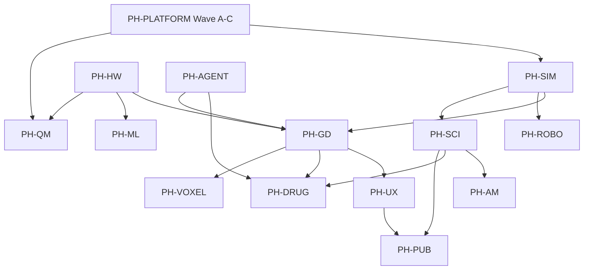

# Li World Studio — master production plan

**Status:** Active (rev. 1 — 2026-05-29)  
**Audience:** Architects, agents, UX builders, package owners  
**Maturity:** ~18% product (interface-heavy, algorithm-light) — see [§1](#1-executive-summary)

**Canonical stack (precedence):**

1. **This document** — hub, modes, agent flows, WP index, DoD  
2. [studio-full-implementation-plan.md](studio-full-implementation-plan.md) — 68 WPs, batches, stub inventory  
3. [world-studio-vision.md](world-studio-vision.md) — why, architecture, program phases  
4. [PH-world-studio-program.md](PH-world-studio-program.md) — cross-program tracker (sync with §1.3)  
5. RFCs under [specs/](specs/) when non-stub; package READMEs for API truth  

**Policy:** Native Li only for product demo — [.cursor/rules/li-studio-demo-native-only.mdc](../../.cursor/rules/li-studio-demo-native-only.mdc). HTML under `deploy/studio-demo/` is marketing-only until an explicit `li-render` embed path lands (§12).

---

## Table of contents

1. [Executive summary](#1-executive-summary)  
2. [Product surface — what Studio is](#2-product-surface--what-studio-is)  
3. [Interaction modes & chrome layout](#3-interaction-modes--chrome-layout)  
4. [Viewport / canvas architecture](#4-viewport--canvas-architecture)  
5. [Agentic system — modes, tools, loops](#5-agentic-system--modes-tools-loops)  
6. [Li integration map](#6-li-integration-map)  
7. [Program registry & phase graph](#7-program-registry--phase-graph)  
8. [Work packages by track](#8-work-packages-by-track)  
9. [PH-UX — SOTA rubric & design system](#9-ph-ux--sota-rubric--design-system)  
10. [PH-PUB — export & publication pipeline](#10-ph-pub--export--publication-pipeline)  
11. [Runtime profiles & vertical DoD](#11-runtime-profiles--vertical-dod)  
12. [Future: optional HTML / web viewport embed](#12-future-optional-html--web-viewport-embed)  
13. [Execution mechanics](#13-execution-mechanics)  
14. [Parallel dispatch & milestone calendar](#14-parallel-dispatch--milestone-calendar)  
15. [Living sync rules](#15-living-sync-rules)  

---

## 1. Executive summary

### 1.1 One sentence

**Li World Studio** is an agent-native, proof-first editor on **Li Engine**: one native executable (`li-studio-demo` → shipped `li-studio`) composes dock, outliner, viewport, timeline, inspector, and agent chrome from **`li-ui` / `li-gui` / `li-render`**, drives seven **sim profiles** through **`li-sim`**, and exposes **`lis mcp li-engine`** + **`@cursor/sdk`** for Cursor-class agent loops — every ship path runs **`lic build`**.

### 1.2 Maturity rollup

| Layer | ~% | Truth |
|-------|-----|-------|
| Vision + RFC index | 90 | GD-0 done |
| Studio shell (PH-GD-1, PH-UX) | 35 | Compose/paint IR; CPU `paint_blit` host; **no wgpu swapchain pixels** |
| Unified sim bridge (PH-SIM) | 30 | SIM-0…3 partial; all 7 profiles in `studio_sim_step_hook` |
| Domain verticals | 15–22 | Tick/workflow stubs; partial physics |
| Algorithms / Layer B | 12 | `verticals.toml` landed; few `full` rows |
| Agent MCP (PH-AGENT) | 25 | AGENT-0 registry + in-process dispatch partial; no stdio server |
| Publish / export (PH-PUB) | 5 | Tool IDs only |
| Proof on `lic build` | 5 | Contracts present; Lean gate open (Wave A) |

### 1.3 Honesty rule

`lic check` composable green = **interface landed**, not product parity. Do not score UX-14 or demo capture as “native product” when pixels come from CPU host or HTML mocks.

### 1.4 North-star metrics

| Area | Target | Program |
|------|--------|---------|
| Viewport | ≥60 fps sustained | PH-UX, PH-HW |
| Panel switch | <100 ms | PH-UX |
| Studio cold load | <2 s to interactive shell | PH-UX |
| AM primary export | ≤3 clicks | PH-UX, PH-AM |
| Agent fix rate | ≥70% on curated `lic check` prompts | PH-AGENT |
| Game ship | Text → playable <5 min (local 8B) | PH-GD, PH-LLM |
| Publish | SVG + HDF5 + repro bundle | PH-PUB |
| a11y | WCAG 2.2 AA chrome | PH-UX UX-10 |
| Compliance | CRITICAL packages SBOM in CI | PH-COMPLY |

---

## 2. Product surface — what Studio is

### 2.1 Native executable (not HTML)

| Artifact | Path | Role |
|----------|------|------|
| Library | `src/lib.li` | Compose/paint shell, sim hooks, MCP dispatch |
| Demo binary | `src/main.li` → `build/li-studio-demo` | Present loop, profile env |
| Agent orchestration | `packages/li-studio-ai` | `studio_ai_*`, apply_patch loop (WP-AG-04) |
| Design tokens | `docs/design/studio-design-tokens.toml` | Spacing, palette, perf gates |

Build/run:

```bash
./scripts/build.sh
lic build src/main.li -o build/li-studio-demo
STUDIO_DEMO_PROFILE=sim_scientific STUDIO_SHELL_DEMO_BUILD_RUN=1 LIG_HOST_PRESENT=1 \
  ./scripts/studio-shell-demo-present-loop.sh
```

### 2.2 Editor regions (stable layout)

```text
┌─────────────────────────────────────────────────────────────────────────┐
│ Topbar: project name · profile chip · play controls · agent invoke      │
├──┬──────────┬──────────────────────────────────────────────┬───────────┤
│  │ Outliner │              VIEWPORT (canvas)                 │ Inspector │
│D │ scene    │  grid · selection · sim viz · particle tiers   │ selection │
│o │ hierarchy│  HUD: FPS · particle count · honesty flags     │ fields    │
│c │          ├──────────────────────────────────────────────┤           │
│k │          │ Agent strip: task · tool trace · cancel       │           │
│  │          ├──────────────────────────────────────────────┤           │
│  │          │ Timeline: tracks · playhead · frame counter     │           │
└──┴──────────┴──────────────────────────────────────────────┴───────────┘
```

**Packages owning regions:**

| Region | Compose API (li-studio) | Paint (li-ui / li-gui) |
|--------|-------------------------|-------------------------|
| Dock | `studio_compose_shell` slots | `studio_paint_compose_panels` |
| Outliner | `studio_compose_outliner` | `studio_paint_outliner` |
| Viewport | `StudioViewportDisplayCompose` | `li-render` draw list + overlay IR |
| Timeline | timeline track on shell compose | playhead rect, track fills |
| Inspector | `studio_panel_switch_inspector` | field rows, adaptive drug layout |
| Agent strip | `studio_compose_agent_chrome` | `studio_paint_agent`, tool trace |
| Command palette | overlay compose (UX-04) | ⌘K modal IR |
| Loading | `studio_compose_shell_loading` | 4 skeleton rects (UX-11) |
| Error overlay | `StudioViewportErrorOverlay` | UX-08 retry strip |

### 2.3 Project on disk

```text
my-project/
  world.li          # Scene + sim config (text, git-diffable)
  studio.toml       # [engine] profile, determinism, export
  assets/           # glTF, textures, assay CSV, etc.
  compliance.toml   # Optional CRITICAL tier overrides
  publish/          # Generated figures + bundle (PH-PUB)
```

---

## 3. Interaction modes & chrome layout

Studio is **one shell** with **mode overlays** — not separate apps. Modes change which panels are prominent, which tools are allowlisted, and which sim hook runs. All modes share the same compose tree; mode state lives in `StudioShellCompose.mode` (to be formalized in WP-UX-15).

### 3.1 Mode matrix

| Mode ID | User goal | Primary panels | Sim hook | Agent default |
|---------|-----------|----------------|----------|---------------|
| **author** | Edit scene, place entities | Outliner + viewport + inspector | `game` / paused sim | `world_scaffold`, patch `.li` files |
| **simulate** | Run physics, scrub timeline | Viewport + timeline + HUD | active profile `sim_step` | `lic_check`, `sim_set_profile` |
| **analyze** | Fields, probes, viz pipelines | Viewport + `sim.viz` sidecar | scientific tiers | export tables, `publish_bundle` |
| **agent** | Delegate multi-step task | Agent strip expanded + tool trace | paused or sandbox tick | full MCP allowlist |
| **publish** | Figures + repro bundle | Export wizard + preview | frozen snapshot | `publish_bundle`, `lic_build` |
| **adaptive** | LITL drug stages | Inspector morphs by stage | `sim_drug_design` | `studio_adaptive_layout` |
| **bench** | Perf honesty / CI capture | HUD metrics prominent | deterministic tier | read-only tools |

### 3.2 Mode transitions

| From | To | Trigger | Proof |
|------|-----|---------|-------|
| author | simulate | Play / Space | timeline playing; `studio_timeline_playback.li` |
| simulate | author | Stop | playhead frozen |
| * | agent | ⌘K → “Ask agent” / task input | agent chrome `running` |
| agent | author | Done / Cancel | FSM idle; WP-AG-04 |
| * | publish | File → Publish… | `lic build` green first |
| sim_drug_design | adaptive | profile auto | `studio_adaptive_drug_inspector.li` |
| * | bench | `STUDIO_BENCH_MODE=1` | bench JSON hooks |

### 3.3 Keyboard-first (UX-09)

| Binding | Action | Status |
|---------|--------|--------|
| ⌘K / Ctrl+K | Command palette | partial — `studio_command_palette.li` |
| Space | Play/pause timeline | partial |
| 1–7 | Profile quick-switch (dev) | env `STUDIO_DEMO_PROFILE` |
| Esc | Cancel agent / close palette | partial |
| Tab | Focus region cycle (UX-10 ring) | partial |

Bridge: [studio-shell-input-bridge.md](studio-shell-input-bridge.md) — SDL/mock → `studio_handle_studio_key`.

### 3.4 Adaptive layouts (drug / role)

**`studio.adaptive`** (WP-DRUG-03): panel sets per LITL stage — discovery, docking, MD, QM, assay, optimize. Inspector fields and agent hints follow `studio_adaptive_drug_inspector`. MCP: `studio_adaptive_layout(role, stage)`.

---

## 4. Viewport / canvas architecture

### 4.1 Layer stack (bottom → top)

| Layer | Owner | Content |
|-------|-------|---------|
| L0 | `li-render` / `lig` | wgpu swapchain: meshes, particles, fields, PBR-lite |
| L1 | `li-studio` compose | Grid, selection ring, error tint |
| L2 | Domain viz | `sim.viz` iso-surfaces, streamlines (PH-SCI) |
| L3 | HUD | FPS, particle tier, honesty flags (UX-13) |
| L4 | Overlays | Command palette, loading skeleton, agent modal |

### 4.2 Present paths (honesty)

| Path | When | `native_pixels` | Retirement |
|------|------|-----------------|------------|
| **A — wgpu swapchain** | Production | true (real) | Target end state |
| **B — CPU paint_blit** | CI / headless | true (CPU honest) | Until WP-GD-05; [c-host-retirement-plan.md](specs/c-host-retirement-plan.md) |
| **C — HTML mock** | Marketing only | false | Never product |
| **D — web embed** | Future optional | TBD | §12 |

### 4.3 Viewport display controls (landed partial)

MCP + runtime hooks (PH-UX viewport display):

| Control | MCP tool | Native hook |
|---------|----------|-------------|
| Background (solid/grid/gradient) | `studio_set_viewport_background` | `li_rt_studio_viewport_display_*` |
| MD particle tier (1k/10k/100k) | `studio_set_particle_display` | tier dots → full particles at WP-GD-05 |
| Biomol style (cartoon/surface/sticks) | `studio_set_biomol_style` | chip + future mesh style |

Smokes: `studio_viewport_display.li`, `studio_viewport_error.li`.

### 4.4 Particle & perf tiers (scientific)

| Tier | Particles | FPS gate | Use |
|------|-----------|----------|-----|
| 0 | 1k | 60 | Laptop / debug |
| 1 | 10k | 60 | Default display |
| 2 | 100k | 30 | Bench / workstation |

Registry: `benchmarks/competitive/studio-ui.toml` → `./scripts/bench-studio-viewport-perf.sh`.

### 4.5 Canvas work packages

| WP | Deliverable | Blocks |
|----|-------------|--------|
| WP-GD-05 | PBR-lite draw list, mesh ingest | PH-HW-2 |
| WP-UX-01 | Selection depth cues | WP-GD-01 |
| WP-UX-08 | GPU/asset error recovery | WP-GD-05 |
| WP-UX-13 | Live FPS/particle HUD | WP-GD-05 |
| WP-UX-14 | wgpu/SDL readback truth | WP-GD-05 |
| WP-SCI-04 | `sim.viz` field panels | WP-GD-05 |
| WP-VOX-02 | AM powder bed voxel view | WP-VOX-01 |

---

## 5. Agentic system — modes, tools, loops

### 5.1 Agent interaction modes

| Mode | UX pattern | Backend | WP |
|------|------------|---------|-----|
| **quick ask** | Single prompt → single tool or reply | `studio_ai_complete` once | WP-AG-02 |
| **task run** | Multi-step FSM, progress bar, cancel | `StudioAgentRun` | WP-AG-02, PR #362 |
| **patch loop** | Plan → diff → `lic check` → retry | `studio_ai_apply_patch` | WP-AG-04 |
| **tool trace** | Visible MCP name + args in strip | `studio_compose_agent_chrome_with_tool` | AGENT-0 done |
| **copilot inline** | Selection-scoped micro-edits | Future | post WP-AG-04 |
| **trusted cloud** | Cursor SDK fallback | `@cursor/sdk` + `[trusted]` label | WP-AG-04 |

**Required chrome (UX-06, studio-agentic-ux skill):** idle / running / blocked / failed / done; step progress; cancel; context label; error strip + retry; last action; undo when safe.

### 5.2 MCP tool registry (AGENT-0 — done)

Canonical: [studio-mcp-tools.md](studio-mcp-tools.md). **11 tools** — all mutations gated on `lic_build`.

| Tool | Purpose | Live? |
|------|---------|-------|
| `world_scaffold` | New project template | stub |
| `sim_set_profile` | Switch `[engine] profile` | stub |
| `lic_check` | JSON diagnostics | partial |
| `lic_build` | Proof gate | partial |
| `publish_bundle` | Repro zip | **done** (manifest contract) |
| `am_export_print` | 3MF/G-code pipeline | stub |
| `chem_dft_run` | QM queue | stub |
| `studio_adaptive_layout` | Drug role layouts | partial |
| `studio_set_viewport_background` | Viewport preset | **partial** |
| `studio_set_particle_display` | MD tier | **partial** |
| `studio_set_biomol_style` | Biomol chip | **partial** |

### 5.3 apply_patch loop (WP-AG-04)

RFC: [studio-cursor-sdk-rfc.md](specs/studio-cursor-sdk-rfc.md)

```text
User prompt
  → studio_ai_complete (lillm local OR Cursor SDK cloud)
  → unified diff for workspace .li paths
  → studio_ai_apply_patch
  → lic check --format=json
  → on error: feed diagnostics to LLM (max N retries)
  → on green: lic build
  → refresh viewport / sim_step / save checkpoint
  → agent strip → done
```

**Security:** tool allowlist; patches scoped to session root; no shell from MCP args; secrets via `guard-secrets.sh`.

### 5.4 Agent packages

| Package | Import | Responsibility |
|---------|--------|----------------|
| `li-studio` | `import studio` | Chrome, MCP IDs, in-process dispatch |
| `li-studio-ai` | `import studio.ai` | Orchestration, patch loop |
| `li-llm` | `import llm` | Local inference (PH-LLM) |
| `lis` | CLI | `lis mcp li-engine` stdio server (WP-AG-03) |

### 5.5 Agent work packages

| WP | Title | State | Exit |
|----|-------|-------|------|
| WP-AG-01 | MCP registry | **done** | `studio_mcp_tools.li` |
| WP-AG-02 | In-process dispatch + FSM | **partial** | `studio_agentic_run.li` |
| WP-AG-03 | `lis mcp li-engine` stdio | stub | integration smoke |
| WP-AG-04 | apply_patch → lic check loop | stub | eval set ≥70% |
| WP-AG-05 | Live chem/AM export tools | stub | composable per tool |
| WP-GD-07 | `world.apply_patch` / `studio.gen` | stub | MCP + smokes |

### 5.6 Eval & regression

| Asset | Location |
|-------|----------|
| Curated patch tasks | `packages/li-studio-ai/fixtures/patch-eval/` (to create) |
| Agent smokes | `studio_agent_*.li`, `studio_mcp_*.li` |
| UX harness | `li-cursor-agents/ux-harness` — native_gui adapter only for product truth |
| Builder agent | `li-cursor-agents/prompts/studio-ui-ux-builder.md` |

---

## 6. Li integration map

### 6.1 Compiler & proof

| Concern | Integration |
|---------|-------------|
| Check before edit | `lic check --format=json` in agent loop |
| Ship gate | `lic build` on every export/publish/print |
| Contracts | `requires` / `ensures` / `decreases` on all exported `def` |
| Wave A blockers | WP-PLAT-01/02 — Lean in build blocks production scale |

### 6.2 Engine stack

```text
li-studio (shell)
  → li-ui (layout IR, tokens, focus rings)
  → li-gui (paint ops)
  → li-render + lig (viewport)
  → li-scene + li-world (entities, save/load)
  → li-sim + li-sim-* (profiles, step, replay)
  → li-physics-* (kernels)
  → li-chem / li-ml-rl (QM, env pools)
```

### 6.3 Profile → package routing

| Profile | Sim package | Studio hook |
|---------|-------------|-------------|
| `game` | `li-physics-runtime` | `studio_game_step_hook` |
| `sim_rl` | `li-ml-rl` | EnvPool + obs |
| `sim_automotive` | `li-sim-automotive` | `sim_automotive_tick_at` |
| `sim_robotics` | `li-sim-robotics` | `sim_robotics_tick_at` |
| `sim_additive` | `li-sim-additive` | slicer workflow |
| `sim_scientific` | `li-sim-scientific` | `studio_sim_scientific_step_hook` |
| `sim_drug_design` | `li-sim-drug-design` | LITL + adaptive |

Smoke: `studio_sim_step_by_profile.li`, `studio_vertical_profile_roundtrip.li`.

### 6.4 External agent hosts

| Host | Protocol | Status |
|------|----------|--------|
| Cursor IDE | MCP `li-engine` | WP-AG-03 |
| Cursor SDK | `@cursor/sdk` apply_patch | WP-AG-04 |
| li-cursor-agents | `studio_ui_ux_builder` lane | operational for UX iteration |
| In-process | `studio_mcp_tool_dispatch` | partial |

---

## 7. Program registry & phase graph

### 7.1 Programs

| Program | Phases | Owner packages | RFC |
|---------|--------|----------------|-----|
| PH-PLATFORM | Wave A–C | `lic`, benches | provability-gaps |
| PH-GD | GD-0…7 | `li-studio`, `li-world`, `li-player` | — |
| PH-UX | UX-0…5 + rubric UX-01…14 | `li-ui`, `li-studio` | studio-ux-design-system |
| PH-SIM | SIM-0…6 | `li-sim`, `li-sim-*` | li-engine-unified-sim |
| PH-HW | HW-0…4 | `lig`, `li-render` | lig-rfc |
| PH-AGENT | AGENT-0…6 | `li-studio-ai`, `lis` | studio-cursor-sdk |
| PH-ML | ML-0…5 | `li-ml` | ml-async-parallel |
| PH-LLM | LLM-01…08 | `li-llm` | PH-LLM-program |
| PH-SCI | SCI-0…7 | `li-sim-scientific`, `sim.viz` | sim-viz-scientific |
| PH-ROBO | ROBO-0…5 | `li-sim-robotics` | li-sim-robotics |
| PH-AM | AM-0…9 | `li-sim-additive` | li-sim-additive |
| PH-DRUG | DRUG-0…7 | `li-sim-drug-design`, `li-chem` | drug-design-lab-loop |
| PH-QM | QM-0…7 | `li-chem` | li-chem-qm |
| PH-VOXEL | VOXEL-0…5 | `li-voxel` | voxel-engine |
| PH-PUB | PUB-0…5 | `li-studio` publish module | publication-export |
| PH-PORT | PORT-0…2 | `lic` triples | portable-targets |
| PH-COMPLY | COMPLY-0…4 | CRITICAL packages | critical-package-compliance |

Tracker sync: [PH-world-studio-program.md](PH-world-studio-program.md).

### 7.2 Phase dependency graph



### 7.3 Recommended delivery waves

| Wave | Theme | Exit milestone |
|------|-------|----------------|
| **W0** | Shell + honesty | GD-1 done ✓; UX-14 partial; native-only rule ✓ |
| **W1** | Sim bridge complete | SIM-2 done ✓; SIM-3 env pool; all profile smokes green |
| **W2** | Native pixels | WP-GD-05 wgpu; retire C hosts (WP-UX-14b) |
| **W3** | Agent loop | WP-AG-03/04; task strip production FSM |
| **W4** | World I/O | `world.li` round-trip; glTF ingest |
| **W5** | Domain depth | SCI/ROBO/AM kernels + oracle columns |
| **W6** | Publish + ship | PH-PUB bundle; `li-player`; compliance SBOM |

---

## 8. Work packages by track

**Full tables:** [studio-full-implementation-plan.md §3](studio-full-implementation-plan.md#3-work-packages-wps) (68 WPs).

### 8.1 Summary index

| Track | WP range | Done | Partial | Stub |
|-------|----------|------|---------|------|
| PH-PLATFORM | WP-PLAT-01…05 | 0 | 1 | 4 |
| PH-GD | WP-GD-01…07 | 1 | 1 | 5 |
| PH-SIM | WP-SIM-00…06 | 3 | 2 | 1 |
| PH-UX | WP-UX-01…14 (+14b) | 1 | 10 | 3 |
| PH-AGENT | WP-AG-01…05 | 1 | 1 | 3 |
| PH-ROBO | WP-ROBO-01…05 | 1 | 1 | 3 |
| PH-AM | WP-AM-01…04 | 1 | 0 | 3 |
| PH-DRUG | WP-DRUG-01…05 | 1 | 1 | 3 |
| PH-SCI | WP-SCI-01…06 | 1 | 1 | 4 |
| PH-QM | WP-QM-01…03 | 1 | 0 | 2 |
| PH-VOXEL | WP-VOX-01…03 | 0 | 0 | 3 |
| PH-PUB | WP-PUB-01…03 | 0 | 0 | 3 |
| Vertical extras | WP-AUTO/RL/GAME | 1 | 3 | 3 |
| Ecosystem | WP-AL-01…03 | 1 | 0 | 2 |

### 8.2 New WPs proposed (this master plan)

| ID | Title | Track | Rationale |
|----|-------|-------|-----------|
| **WP-UX-15** | Studio interaction modes FSM | PH-UX | Formalize §3 mode matrix on compose |
| **WP-UX-16** | Publish wizard UI | PH-UX / PH-PUB | ≤3-click export flows |
| **WP-AG-06** | Agent eval harness + 70% gate | PH-AGENT | §5.6 regression |
| **WP-GD-08** | Timeline ↔ sim_step sync | PH-GD | Scrubbing drives deterministic replay |

Add rows to full implementation plan when scheduled.

### 8.3 Critical path (serial)

```text
WP-PLAT-02 (Lean build)
  → WP-GD-05 (wgpu viewport)
  → WP-UX-14 (native_pixels truth)
  → WP-AG-03 (MCP server)
  → WP-AG-04 (patch loop)
  → WP-PUB-03 (repro bundle)
```

---

## 9. PH-UX — SOTA rubric & design system

Canonical rubric: [competitive-intel/ui-ux-by-dimension.md](competitive-intel/ui-ux-by-dimension.md).

### 9.1 Performance gates

| Gate | Target | Measure |
|------|--------|---------|
| Viewport FPS | ≥60 | `bench-studio-viewport-perf.sh` |
| Panel switch | <100 ms | composable timing |
| Cold load | <2 s | bench JSON `load_ms` |
| MD 10k @ 60 fps | tier 1 | tier-2 MD + render path |
| MD 100k @ 30 fps | tier 2 | workstation |
| Memory | ≤512 MiB warn | `animate_md_import` registry |

### 9.2 UX dimensions (score 0–3 per iteration)

| ID | Dimension | SOTA refs | Key WPs |
|----|-----------|-----------|---------|
| UX-01 | Viewport clarity | Godot, Blender | WP-UX-01, WP-GD-05 |
| UX-02 | Timeline / playback | DaVinci, Unreal Sequencer | WP-UX-02, WP-GD-08 |
| UX-03 | Inspector density | Unity, Figma | WP-UX-03 |
| UX-04 | Command palette | Linear, VS Code | WP-UX-04 |
| UX-05 | Profile switching | Notion DB | WP-UX-05 ✓ |
| UX-06 | Agentic AI chrome | Cursor, Copilot | WP-UX-06, WP-AG-02 |
| UX-07 | Empty states | shadcn | WP-UX-07 |
| UX-08 | Error recovery | Primer | WP-UX-08 |
| UX-09 | Keyboard-first | Blender, Linear | WP-UX-09 |
| UX-10 | Accessibility | WCAG AA | WP-UX-10 |
| UX-11 | Loading skeleton | Material 3 | WP-UX-11 |
| UX-12 | Copy & terminology | Diátaxis | WP-UX-12, WP-PUB-01 |
| UX-13 | Perf honesty HUD | Game engines | WP-UX-13 |
| UX-14 | Product truth | No mock as native | WP-UX-14, WP-UX-14b |

### 9.3 Design tokens

Source: [docs/design/studio-design-tokens.toml](../design/studio-design-tokens.toml)  
Generated: [studio-design-system.generated.md](../design/studio-design-system.generated.md)  
Module target: `studio.design` (WP-UX-12).

**Anti-patterns:** dashboard sprawl; hidden agent failures; HTML passed as product; spinner without step list; shifting layout during agent stream.

### 9.4 UX builder loop

| Asset | Path |
|-------|------|
| Plan loop YAML | `docs/superpowers/plans/2026-05-24-studio-ui-ux-plan-loop.md` |
| Builder prompt | `li-cursor-agents/prompts/studio-ui-ux-builder.md` |
| Iteration reports | `docs/reports/studio-ui-ux/iterations/` |
| Skills | `lic/.cursor/skills/studio-*` |

Wave 1 (studio-ux-00…10): **done** in YAML. Wave 2 (11…19): merge into YAML when resuming loop.

---

## 10. PH-PUB — export & publication pipeline

### 10.1 Export types

| Kind | Formats | API / tool | WP |
|------|---------|------------|-----|
| Figures | SVG, PDF, 300+ dpi PNG | `studio.publish.figure` | WP-PUB-01 |
| Scientific tables | HDF5, CSV, VTK | `studio.publish.table` | WP-PUB-02 |
| Game ship | `li-player` bundle | WP-GD-06 | WP-GD-06 |
| AM print | 3MF, G-code | `am_export_print` MCP | WP-AM-03 |
| Repro bundle | `publish.zip` + manifest | `publish_bundle` MCP | WP-PUB-03 |

### 10.2 Publish mode flow (≤3 clicks target)

```text
1. User: Publish → Figure (or Export print job)
2. Studio: run lic build (blocking overlay if fail)
3. Snapshot: world + sim checksum + git hash + lic version
4. Render: vector raster / slice / table writers
5. Write: publish/ + audit log entry (PH-COMPLY)
6. Optional: open folder / send to printer (trusted tier)
```

### 10.3 Reproducibility manifest (WP-PUB-03)

```json
{
  "lic_version": "...",
  "engine_profile": "sim_scientific",
  "determinism_tier": 2,
  "sim_checksum": "...",
  "world_sha256": "...",
  "figures": ["figures/fig1.svg"],
  "data": ["data/traj.h5"]
}
```

RFC to expand: [publication-export-rfc.md](specs/publication-export-rfc.md) (currently stub — flesh from this §).

---

## 11. Runtime profiles & vertical DoD

Per-profile **done** criteria: [studio-full-implementation-plan.md §6](studio-full-implementation-plan.md#6-definition-of-done-per-runtime-profile).

| Profile | Ship headline | Blocking WPs |
|---------|---------------|--------------|
| `game` | Playable in `li-player` ≤5 min | WP-GD-03, WP-GD-05, WP-GD-06, WP-GAME-02 |
| `sim_rl` | Async env pool + replay checksum | WP-SIM-03, WP-RL-02, WP-SIM-04 |
| `sim_automotive` | Map + sensors in viewport | WP-AUTO-02, WP-SIM-05 |
| `sim_robotics` | 6-DOF IK + live inspector | WP-ROBO-03, WP-UX-03 |
| `sim_additive` | Thermal gate → valid 3MF | WP-AM-02, WP-AM-03 |
| `sim_scientific` | Tier-2 kernels + sim.viz | WP-SCI-03, WP-SCI-04, WP-PLAT-05 |
| `sim_drug_design` | LITL adaptive + live QM | WP-DRUG-03, WP-DRUG-04, WP-QM-02 |

Recording honesty: [VERTICALS-RECORDING.md](../demo/VERTICALS-RECORDING.md).

---

## 12. Future: optional HTML / web viewport embed

**Not a substitute for native studio** ([li-studio-demo-native-only.mdc](../../.cursor/rules/li-studio-demo-native-only.mdc)).

When prioritized, embed path must:

1. Live under `li-render` or `packages/li-studio-webview` with explicit `def` API  
2. Same honesty flags as wgpu (UX-14)  
3. Smokes + bench hooks — no ad-hoc `deploy/*.html` product demos  
4. Agent tools unchanged — still `lic check` / `lic build` on Li sources  

Until then: marketing HTML stays in `deploy/studio-demo/` with mock banner.

---

## 13. Execution mechanics

### 13.1 Proof commands (daily)

```bash
lic check li-tests/smoke/studio_shell_demo.li
lic check li-tests/smoke/studio_vertical_profile_roundtrip.li
lic check li-tests/smoke/studio_sim_step_by_profile.li
lic check li-tests/smoke/studio_mcp_tools.li
LIG_HOST_PRESENT=1 ./scripts/studio-verticals-capture-native.sh
./scripts/bench-studio-viewport-perf.sh
```

### 13.2 Agent lanes

| Agent | Scope |
|-------|-------|
| `studio_ui_ux_builder` | UX rubric, native capture, design tokens |
| Compiler loop | Wave A first — [li-agent-scope-studio-sim.mdc](../../.cursor/rules/li-agent-scope-studio-sim.mdc) |
| Domain researchers | numerics / sim goals — not studio shell |

### 13.3 Demo & capture policy

| Action | Allowed |
|--------|---------|
| Local native capture | ✓ `record-studio-verticals-demo.sh` |
| GitHub Release demo MP4 | ✗ |
| HTML as product demo | ✗ |
| CPU paint_blit evidence | ✓ labeled in capture.json |

### 13.4 CI gates

| Gate | Script |
|------|--------|
| Studio smokes | package CI / `lic check` matrix |
| Viewport perf | `bench-studio-viewport-perf.sh` |
| UX plan | `studio-ui-ux-plan-gates.sh` |
| Vertical registry | `verticals.toml` ingest |
| No motion a11y | `check-dashboard-no-motion.mjs` (dashboard only) |

---


### 13.5 World Studio master plan loop (goal-directed)

| Command | Purpose |
|---------|---------|
| `python3 ./scripts/world-studio-plan-loop.py --once` | One iteration (`world_studio_builder`) |
| `python3 ./scripts/world-studio-plan-loop.py` | Until all `wsm-w*` todos done |
| `./scripts/world-studio-plan-continuous.sh` | Daemon with idle sleep |
| `../scripts/start-goal-directed-sprints.ps1 -Sprint world-studio` | SDK sprint from workspace root |

Plan YAML: `docs/superpowers/plans/2026-05-29-world-studio-master-plan-loop.md`  
Goal file: `data/goal-directed-sprints/world-studio-master-plan.md`

## 14. Parallel dispatch & milestone calendar

### 14.1 Immediate parallel batch (from full plan)

**Batch 1:** WP-AL-02, WP-SCI-02, WP-RL-01, WP-GAME-01, WP-ROBO-02, WP-DRUG-02, WP-UX-05, WP-AG-02, WP-VOX-01, WP-PUB-01

### 14.2 Suggested calendar (quarters)

| Quarter | Focus | Milestone |
|---------|-------|-----------|
| **Q2 2026** | W1–W2 | All profile smokes; wgpu alpha; UX-14 honest readback |
| **Q3 2026** | W3–W4 | MCP server + patch loop; `world.li` I/O |
| **Q4 2026** | W5 | SCI-03 kernels; AM export; ROBO IK |
| **Q1 2027** | W6 | PH-PUB bundle; CRITICAL SBOM; SUS ≥75 study |

Adjust when Wave A (`WP-PLAT-02`) slips.

---

## 15. Living sync rules

1. **WP state change** → update [studio-full-implementation-plan.md §1.3](studio-full-implementation-plan.md#13-landed-on-branch-done-vs-remaining) and [PH-world-studio-program.md](PH-world-studio-program.md).  
2. **`workload_class` change** → bump `benchmarks/competitive/verticals.toml` `updated`.  
3. **RFC stub → partial** → expand matching file under `specs/` when WP leaves stub.  
4. **New MCP tool** → [studio-mcp-tools.md](studio-mcp-tools.md) + smoke + `studio_mcp_tool_count`.  
5. **Vision §3 baseline** → refresh when GD-1/SIM-0 land (remove false “gaps”).  
6. **Mode / agent FSM change** → update §3 and §5 in this doc + WP-UX-15.  

---

## Appendix A — RFC index

| RFC | Track |
|-----|-------|
| [li-engine-unified-sim-rfc.md](specs/li-engine-unified-sim-rfc.md) | PH-SIM |
| [studio-cursor-sdk-rfc.md](specs/studio-cursor-sdk-rfc.md) | PH-AGENT |
| [studio-ux-design-system-rfc.md](specs/studio-ux-design-system-rfc.md) | PH-UX |
| [publication-export-rfc.md](specs/publication-export-rfc.md) | PH-PUB |
| [c-host-retirement-plan.md](specs/c-host-retirement-plan.md) | PH-UX / PH-HW |
| [lig-rfc.md](specs/lig-rfc.md) | PH-HW |
| [drug-design-lab-loop-rfc.md](specs/drug-design-lab-loop-rfc.md) | PH-DRUG |
| [sim-viz-scientific-rfc.md](specs/sim-viz-scientific-rfc.md) | PH-SCI |
| [li-sim-additive-rfc.md](specs/li-sim-additive-rfc.md) | PH-AM |
| [li-sim-robotics-rfc.md](specs/li-sim-robotics-rfc.md) | PH-ROBO |
| [ml-async-parallel-rfc.md](specs/ml-async-parallel-rfc.md) | PH-ML |
| [critical-package-compliance-rfc.md](specs/critical-package-compliance-rfc.md) | PH-COMPLY |

## Appendix B — Related documents

| Doc | Role |
|-----|------|
| [world-studio-vision.md](world-studio-vision.md) | Vision & program phases |
| [studio-full-implementation-plan.md](studio-full-implementation-plan.md) | 68 WPs, stubs, batches |
| [PH-world-studio-program.md](PH-world-studio-program.md) | Tracker table |
| [PH-LLM-program.md](PH-LLM-program.md) | Local LLM for agents |
| [studio-mcp-tools.md](studio-mcp-tools.md) | MCP contract |
| [algorithms-and-libraries-plan.md](../ecosystem/algorithms-and-libraries-plan.md) | Layer B verticals |
| [README.md](../../README.md) | API & demo commands |

---

**Maintainers:** Treat this file as the **navigation hub**. Deep WP tables stay in `studio-full-implementation-plan.md`; do not duplicate state in two places — link and summarize here.
