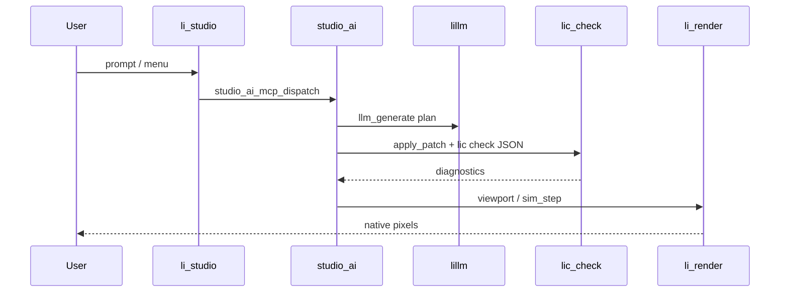

# RFC: Studio + Cursor SDK agentic interface

**Status:** Draft (Wave 0 expanded)  
**Date:** 2026-05-29  
**Vision:** [world-studio-vision.md](../world-studio-vision.md)  
**Package:** `packages/li-studio-ai` (`import studio.ai`)

## Problem

Li World Studio needs an in-process agent loop: user prompt → plan → code patch →
`lic check` validation → viewport/sim update — all native Li, no HTML demos.

## Architecture

## apply_patch loop (WP-AG-04)

1. Agent receives user intent via Studio task strip
2. `studio_ai_complete(prompt)` → plan text (local `llm_generate` or Cursor SDK cloud)
3. Agent emits unified diff / patch for target `.li` files
4. `studio_ai_apply_patch(patch, path)` writes patch and runs `lic check --format=json`
5. On diagnostics: feed errors back to LLM; retry until green or user cancel
6. On success: refresh viewport / run sim hook

**Gate:** eval set of patch tasks passes with zero false-green merges.

## MCP integration (WP-AG-02 / WP-AG-03)

| WP | Deliverable |
|----|-------------|
| WP-AG-02 | In-process `studio_ai_mcp_dispatch(tool_name, args)` |
| WP-AG-03 | `lis mcp li-engine` stdio server (rebase #283 after Wave A stable) |

Tool allowlist: viewport background, sim step, world I/O, chem export stubs — no
arbitrary shell.

## lillm integration

| Condition | Backend |
|-----------|---------|
| Weights loaded (`llm_model_weights_valid`) | `llm_generate` |
| No local weights | Cursor SDK cloud via `@cursor/sdk` |
| User offline + no weights | Honest error in task strip |

See [lillm-rfc.md](lillm-rfc.md).

## Work packages

| WP | Source | Target |
|----|--------|--------|
| WP-AG-02 | partial in li-studio | Full MCP dispatch + tool args |
| WP-AG-03 | **partial** | `scripts/studio-mcp-li-engine-stub.sh` stdio JSON-RPC (transport); Li dispatch in-process |
| WP-AG-04 | **partial** | `studio_ai_apply_patch`; `scripts/studio-lic-check-json-stub.sh` |
| WP-AG-05 | stub | Live `chem_dft_run`, `am_export_print` dispatch |
| WP-GD-07 | stub | `world.apply_patch` + `studio.gen` contracts |
| PR #362 | DRAFT | Agentic run state FSM (`studio_ai_cancel_task`, task strip) |

## Li syntax

Use **`def`** for all new APIs. **`extern proc`** only for FFI/runtime bridges already
in `li-studio`. Contracts on every export.

## Security

- Tool allowlist; no arbitrary code exec from MCP args
- Patches limited to workspace paths under agent session root
- Secrets: never log tokens; use existing `guard-secrets.sh` hook
- Cloud fallback: user-visible `[trusted]` label when using Cursor SDK

## Dependencies

- [PH-world-studio-program.md](../PH-world-studio-program.md)
- [PH-LLM-program.md](../PH-LLM-program.md)
- `packages/li-studio`, `packages/li-llm`, `packages/li-studio-ai`

## Open questions

- [ ] Max patch retry count before surfacing blocked state
- [ ] Merge PR #362 agentic FSM before WP-AG-04 loop
- [ ] In-process vs subprocess `lic check` for latency
