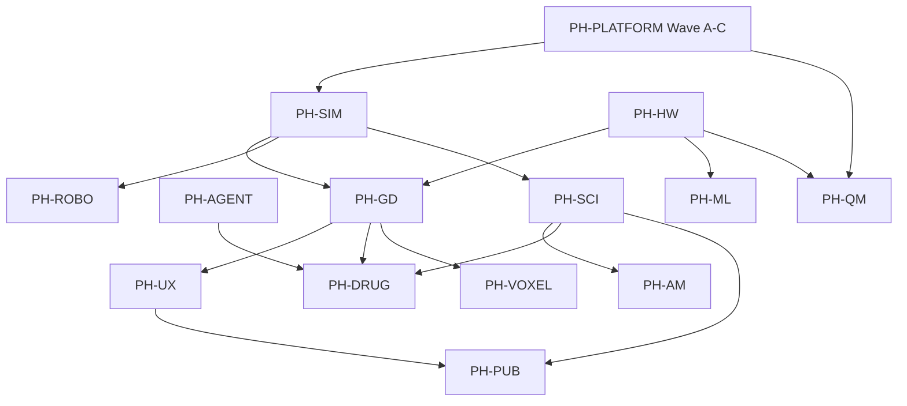

# Li World Studio — stub → full implementation plan

**Status:** Active (rev. 1 — 2026-05-26)  
**Branch baseline:** `cursor/wp-lic-01-verticals-toml` @ `e1fa5826` (includes `efb3739f`…`fddb41ca` vertical increment series)  
**Audience:** Architects, parallel agents, package owners  
**Navigation hub:** [WORLD-STUDIO-MASTER-PLAN.md](WORLD-STUDIO-MASTER-PLAN.md)
**Canonical vision:** [world-studio-vision.md](world-studio-vision.md) · [PH-world-studio-program.md](PH-world-studio-program.md) · [algorithms-and-libraries-plan.md](../ecosystem/algorithms-and-libraries-plan.md)

**Honesty rule:** `lic check` composable green = **interface landed**, not product parity. Wave A compiler gates ([provability-gaps.md](../verification/provability-gaps.md) G-VERIFY-01) block “production” domain kernels.

---

## 1. Executive summary

### 1.1 Platform rollup

| Layer | Maturity | Notes |
|-------|----------|-------|
| **Vision + RFC index** | ~90% | GD-0, specs under `docs/game-dev/specs/` |
| **Studio shell (PH-GD-1, PH-UX)** | ~35% | Compose/paint IR, ⌘K, profiles, agent chrome — **no wgpu viewport pixels** (`native_pixels` CPU host only) |
| **Unified sim bridge (PH-SIM)** | ~30% | SIM-0…3 partial; all 7 profiles wired in `studio_sim_step_hook` |
| **Domain packs (verticals)** | ~15–22% | Tick/workflow stubs; partial robo/auto/additive/scientific/game physics |
| **Algorithms / Layer B benches** | ~12% | `verticals.toml` landed; few `partial` rows; no LAMMPS/GROMACS/Psi4 oracle columns |
| **Proof certificate (`lic build`)** | ~5% | Contracts present; Lean not wired on build |

**Overall World Studio product maturity: ~18%** (interface-heavy, algorithm-light).

### 1.2 Per vertical profile (honest %)

Scores: **Shell** (profile chip, compose, native present host) · **Domain** (sim hook, package logic) · **Bench** (`verticals.toml` + tier hooks) · **Overall**.

| Profile | Shell | Domain | Bench | **Overall** | Branch status (efb3739f→HEAD) |
|---------|-------|--------|-------|-------------|-------------------------------|
| `game` | 40% | 22% | 12% | **~24%** | `studio_game_step_hook` + `game_physics_step_hook`; GD-2 checkpoint partial |
| `sim_rl` | 35% | 15% | 5% | **~18%** | `EnvPoolStub` / `env_pool_stub_step` (SIM-3 partial) |
| `sim_automotive` | 32% | 16% | 5% | **~17%** | `sim_automotive_tick_at` + bicycle kinematic smoke |
| `sim_robotics` | 32% | 20% | 8% | **~19%** | 2-DOF FK, workspace, `sim_robotics_tick_at` (ROBO-0) |
| `sim_additive` | 32% | 22% | 10% | **~20%** | Slicer plan + export gates (AM-0); no printer I/O |
| `sim_scientific` | 34% | 20% | 18% | **~22%** | Tier tick stub + Li oracle checksums; no `sim.viz` viewport |
| `sim_drug_design` | 34% | 18% | 6% | **~19%** | LITL workflow + adaptive inspector hint (DRUG-0/1 partial) |

Recording matrix: [VERTICALS-RECORDING.md](../demo/VERTICALS-RECORDING.md) — all seven profiles have `native_pixels=1` on **CPU present host**, not swapchain readback.

### 1.3 Landed on branch (DONE vs remaining)

| ID | State | Evidence |
|----|-------|----------|
| PH-GD-0 | **DONE** | Vision + RFC index |
| PH-GD-1 | **DONE** (MVP) | Shell demo, outliner, timeline, MCP IDs |
| PH-GD-2 | **PARTIAL** | `studio_game_world_checkpoint_*` + `world_save_to_path` / `world_load_from_path` (single-line `world.li`); scene graph / assets still stub |
| PH-SIM SIM-0 | **DONE** | Profile bridge, contracts |
| PH-SIM SIM-1 | **DONE** | `sim_step` / `studio_sim_step_hook` |
| PH-SIM SIM-2 | **DONE** | Replay metadata on session |
| PH-SIM SIM-3 | **PARTIAL** | `li-ml-rl` `EnvPoolStub` only |
| PH-ROBO ROBO-0 | **DONE** | Tick + workspace composables |
| PH-AM AM-0 | **DONE** | Slicer workflow stub |
| PH-DRUG DRUG-0 | **DONE** | LITL workflow stub |
| PH-DRUG DRUG-1 | **PARTIAL** | Adaptive inspector payloads, MCP harness |
| PH-AGENT AGENT-0 | **DONE** | Tool ID registry |
| PH-AGENT AGENT-1 | **PARTIAL** | In-process `studio_mcp_tool_dispatch` plus `StudioAgentRun` world-patch → `lic_check` → `lic_build` state model; no `lis mcp li-engine` |
| AL-1 `verticals.toml` | **DONE** | Layer B registry (15 rows) |
| PH-UX UX-02…11 | **PARTIAL** | Compose-level; mocks for timeline/viewport/contrast |
| PH-HW HW-3 | **PARTIAL** | Host present / input bridge |
| Wave A `lic` 2e/2f | **OPEN** | Blocks production domain scale-up |

---

## 2. Phases and dependencies

Fourteen program tracks. Arrows = hard prerequisite.



| Order | Phase | PH program | Depends on | Primary exit |
|-------|-------|------------|------------|--------------|
| 0 | **PH-PLATFORM** | Wave A–C (`lic`, `lip`, benches) | — | `lic build` Lean green; tier-2 external MD oracle |
| 1 | **PH-SIM** | SIM-0…6 | PH-PLATFORM (tail), `li-physics-runtime` | One `sim.step` family + replay + sensors |
| 2 | **PH-GD** | GD-0…7 | PH-SIM-1, `li-scene`, `li-ui` | Viewport + world I/O + `li-player` |
| 3 | **PH-HW** | HW-0…4 | PH-PLATFORM | `lig` wgpu present, CUDA/HIP smoke |
| 4 | **PH-UX** | UX-0…5 | PH-GD-1 | 60 fps, ≤3-click AM export, WCAG AA measured |
| 5 | **PH-AGENT** | AGENT-0…6 | `lic check --format=json` | `lis mcp li-engine` + SDK apply_patch loop |
| 6 | **PH-ML** | ML-0…5 | PH-HW-1, PH-SIM-3 | Async env pools, JobGraph |
| 7 | **PH-SCI** | SCI-0…7 | PH-SIM-2, tier-2 physics | MD/heat/CFD in viewport + `sim.viz` |
| 8 | **PH-ROBO** | ROBO-0…5 | PH-SIM-1 | IK, sensors, optional ROS2 bridge |
| 9 | **PH-AM** | AM-0…9 | PH-SCI-2, PH-UX-3 | Thermal sim → `sim.export.print` |
| 10 | **PH-DRUG** | DRUG-0…7 | PH-SCI-2, PH-GD-1, PH-AGENT | Lab-in-the-loop + `studio.adaptive` |
| 11 | **PH-QM** | QM-0…7 | PH-HW, PH-COMPLY | `chem.dft` trusted + native subset |
| 12 | **PH-VOXEL** | VOXEL-0…5 | PH-GD-5 | Unified `VoxelGrid` |
| 13 | **PH-PUB** | PUB-0…5 | PH-UX, `sim.viz` | Figures + repro bundle |

Cross-tracks (not separate phases above): **PH-PORT**, **PH-COMPLY**, **PH-CIN** (cinematic rows in `verticals.toml`).

---

## 3. Work packages (WPs)

**Fields:** ID · Title · Vertical/profile · State · Target · Proof gate · Size · Blocks · Parallel?

### 3.1 PH-PLATFORM

| ID | Title | Profile | State | Target deliverable | Proof gate | Cx | Blocks | Par? |
|----|-------|---------|-------|-------------------|------------|-----|--------|------|
| WP-PLAT-01 | Wave A 2e contract checker plan | platform | stub | Phase 2e plan + G-CONTRACT-* exit tests | `lic check` on contract fixtures | L | — | N |
| WP-PLAT-02 | Wave A 2f Lean in `lic build` | platform | stub | Build fails open goals | `lic build` negative test | L | WP-PLAT-01 | N |
| WP-PLAT-03 | Tier-0 bench gate in CI | platform | **partial** | `--tier0-only` in plan scripts | `./scripts/check-*-bench.sh` | S | — | Y |
| WP-PLAT-04 | `lip` / lockfile repro (8b) | platform | stub | `lip install` green on `packages/li.toml` | composable workspace import | L | WP-PLAT-02 | N |
| WP-PLAT-05 | LAMMPS/GROMACS oracle column | platform | stub | `md_oracle.toml` driver + registry row | tier-2 verify + csv column | L | WP-PLAT-03 | Y |

### 3.2 PH-GD

| ID | Title | Profile | State | Target | Proof gate | Cx | Blocks | Par? |
|----|-------|---------|-------|--------|------------|-----|--------|------|
| WP-GD-01 | Studio shell MVP | game | **done** | Outliner, timeline, demo bin | `lic check li-tests/smoke/studio_shell_demo.li` | M | PH-GD-0 | N |
| WP-GD-02 | World snapshot checkpoint | game | **done** | Post-tick `WorldSnapshot` validity | `studio_world_checkpoint_after_tick.li` | S | WP-GD-01 | Y |
| WP-GD-03 | `world.li` text save/load | game | **done** | Serialize snapshot + assets refs | composable `import_world_roundtrip.li` | M | WP-GD-02 | N |
| WP-GD-04 | glTF ingest (`li-assets`) | game | stub | Load mesh into scene | `lic check packages/li-assets/...` | M | WP-GD-03 | Y |
| WP-GD-05 | `li-render` PBR-lite | game, sim_scientific | stub | wgpu draw list | `viewport_fps.toml` not `stub_pass` | L | PH-HW-2 | N |
| WP-GD-06 | `li-player` publish | game | **done** | Headless play + ship bundle | smoke `player_publish.li` | L | WP-GD-03, WP-GD-05 | Y |
| WP-GD-07 | `studio.gen` / AI patch hooks | game | stub | `world.apply_patch` contract | `lic check` + MCP tool | M | PH-AGENT-2 | N |

### 3.3 PH-SIM

| ID | Title | Profile | State | Target | Proof gate | Cx | Blocks | Par? |
|----|-------|---------|-------|--------|------------|-----|--------|------|
| WP-SIM-00 | Profile bridge SIM-0 | all sim | **done** | `sim_session_apply_studio_profile` | `studio_profile_bridge.li` | S | — | N |
| WP-SIM-01 | Session tick SIM-1 | all sim | **done** | `sim_reset`/`sim_step` | `sim_step_stub.li` | S | WP-SIM-00 | N |
| WP-SIM-02 | Replay metadata SIM-2 | all sim | **done** | `sim_session_replay_*` | `sim_replay_stub.li` | S | WP-SIM-01 | Y |
| WP-SIM-03 | RL EnvPool SIM-3 | sim_rl | **done** | Persistent pool + obs contract | `env_pool_step_contract.li`, `env_pool_session_persistent.li` | M | WP-SIM-01 | Y |
| WP-SIM-04 | Full `SimWorld` replay buffer | all sim | stub | Entity/state ring buffer | composable replay roundtrip | L | WP-SIM-02 | N |
| WP-SIM-05 | Sensor bus stub | sim_automotive, sim_robotics | **partial** | `sim.sensors` raycast IDs | `sensor_bus_raycast_contract.li` | M | WP-SIM-01 | Y |
| WP-SIM-06 | `studio.toml` engine section | all | **partial** | Parse `determinism_tier`, export | example vertical `studio.toml` | S | WP-SIM-00 | Y |

### 3.4 PH-UX

| ID | Title | Profile | State | Target | Proof gate | Cx | Blocks | Par? |
|----|-------|---------|-------|--------|------------|-----|--------|------|
| WP-UX-01 | Viewport grid + selection ring | game | **partial** | Depth cues in compose | `studio_shell_demo.li` | S | WP-GD-01 | Y |
| WP-UX-02 | Timeline playback | game | **partial** | Playhead from `sim_step` tick | `studio_timeline_playback.li` | S | WP-GD-01 | Y |
| WP-UX-03 | Inspector fields | sim_robotics, game | **partial** | ≥2 rows on selection + live joint encode | `studio_inspector_fields.li`, `studio_sim_robotics_inspector.li` | S | WP-GD-01 | Y |
| WP-UX-04 | Command palette | all | **done** | ⌘K overlay + action dispatch | `studio_command_palette.li` | S | WP-GD-01 | Y |
| WP-UX-05 | Profile chip + TOML | all 7 | **done** | `studio_vertical_profile_roundtrip.li` | smoke | S | WP-SIM-00 | Y |
| WP-UX-06 | Agent chrome | sim_rl, sim_drug | **partial** | Task states + cancel | `studio_agent_*.li` | M | WP-GD-01 | Y |
| WP-UX-07 | Empty states | all | **partial** | Inspector/viewport hints | smokes | S | WP-GD-01 | Y |
| WP-UX-08 | Viewport error recovery | all | **done** | GPU/asset overlay + wgpu probe | `studio_viewport_error.li` | S | WP-GD-05 | Y |
| WP-UX-09 | Keyboard-first (SDL/mock) | all | **partial** | `InputState` bridge | `studio_keyboard_input_json.li` | M | PH-HW-3 | Y |
| WP-UX-10 | WCAG contrast measured | all | stub | Real ratio from host | `studio_accessibility.li` fails ratio | M | WP-GD-05 | Y |
| WP-UX-11 | Loading skeleton | all | **partial** | 4 fill cmds | `studio_shell_loading.li` | S | WP-GD-01 | Y |
| WP-UX-12 | `studio.design` tokens | all | stub | Token module | composable import | M | WP-UX-04 | Y |
| WP-UX-13 | FPS / particle honesty HUD | sim_scientific | stub | Live counts in viewport | render smoke | M | WP-GD-05 | N |
| WP-UX-14 | Product truth `native_pixels` | all 7 | **partial** | wgpu/SDL readback | `record-studio-verticals-demo.sh` | L | WP-GD-05, PH-HW-2 | N |

### 3.5 PH-AGENT

| ID | Title | Profile | State | Target | Proof gate | Cx | Blocks | Par? |
|----|-------|---------|-------|--------|------------|-----|--------|------|
| WP-AG-01 | MCP tool registry AGENT-0 | all | **done** | Stable tool IDs | `studio_mcp_tools.li` | S | — | Y |
| WP-AG-02 | In-process dispatch AGENT-1 | all | **done** | `studio_mcp_tool_dispatch` + `StudioAgentRun` state model | `studio_mcp_dispatch_run.li`, `studio_agentic_run.li` | M | WP-AG-01 | Y |
| WP-AG-03 | `lis mcp li-engine` HTTP server | all | stub | Wire tools to studio | integration smoke | L | WP-AG-02 | N |
| WP-AG-04 | `@cursor/sdk` apply_patch loop | all | stub | Prompt → patch → `lic check` | agent eval set | L | WP-AG-03, WP-GD-07 | N |
| WP-AG-05 | `chem_dft_run` / `am_export_print` live | sim_drug, sim_additive | stub | Domain dispatch | composable per tool | M | WP-AG-03 | Y |

### 3.6 PH-ROBO (`sim_robotics`)

| ID | Title | State | Target | Proof gate | Cx | Blocks | Par? |
|----|-------|-------|--------|------------|-----|--------|------|
| WP-ROBO-01 | ROBO-0 tick + workspace | **done** | `sim_robotics_tick_at` | `tick_stub.li`, `import_sim_robotics_workspace.li` | S | WP-SIM-01 | Y |
| WP-ROBO-02 | 2-DOF FK + torque (partial) | **partial** | `robo_arm_*` | `arm_workspace.li` | M | WP-ROBO-01 | Y |
| WP-ROBO-03 | IK stub → numeric | **partial** | Target pose → joint angles (6-DOF) | `robo_ik_6dof.li`, `studio_sim_robotics_inspector.li` | L | WP-ROBO-02, math quat | N |
| WP-ROBO-04 | Factory cell layout | stub | Multi-arm scene | composable | L | WP-ROBO-03 | N |
| WP-ROBO-05 | ROS2 bridge (trusted) | stub | `extern` joint state | audit log | L | PH-COMPLY | N |

### 3.7 PH-AM (`sim_additive`)

| ID | Title | State | Target | Proof gate | Cx | Blocks | Par? |
|----|-------|-------|--------|------------|-----|--------|------|
| WP-AM-01 | AM-0 slicer workflow | **done** | slice→preview→export | `import_sim_additive_slicer_workflow.li` | M | WP-SIM-01 | Y |
| WP-AM-02 | `require_sim_pass` thermal gate | stub | `heat_equation` witness | tier-2 heat + composable | L | PH-SCI-2 | N |
| WP-AM-03 | `sim.export.print` 3MF/G-code | **done** | `sim_export_print` + `studio_am_export_three_click_flow` | `sim_export_print.li`, `studio_am_export_three_click.li` | M | WP-AM-02, WP-UX-14 | N |
| WP-AM-04 | OctoPrint-class send (trusted) | stub | Audited HTTP | compliance log | L | WP-AM-03 | N |

### 3.8 PH-DRUG (`sim_drug_design`)

| ID | Title | State | Target | Proof gate | Cx | Blocks | Par? |
|----|-------|-------|--------|------------|-----|--------|------|
| WP-DRUG-01 | DRUG-0 LITL workflow | **done** | Five-stage stub | `import_sim_drug_design_litl_workflow.li` | M | WP-SIM-01 | Y |
| WP-DRUG-02 | DRUG-1 adaptive inspector | **partial** | Stage from tick | `studio_adaptive_drug_inspector.li` | S | WP-DRUG-01 | Y |
| WP-DRUG-03 | `studio.adaptive` role layouts | **partial** | Panel sets per stage | composable + UX-07 | M | WP-DRUG-02 | N |
| WP-DRUG-04 | Live `chem.dft` queue | stub | QM job status in UI | `chem_dft_run` MCP | L | PH-QM-1 | N |
| WP-DRUG-05 | Lab ingest + retrain hook | stub | Assay CSV witness | bioeng composable | L | WP-DRUG-04 | N |

### 3.9 PH-SCI (`sim_scientific`)

| ID | Title | State | Target | Proof gate | Cx | Blocks | Par? |
|----|-------|-------|--------|------------|-----|--------|------|
| WP-SCI-01 | Scientific tick tiers | **done** | MD/heat/rigid dispatch | `scientific_tick_tiers.li` | S | WP-SIM-01 | Y |
| WP-SCI-02 | Li oracle checksums | **partial** | MD + heat constants | `scientific_oracle_bench.li` | S | WP-SCI-01 | Y |
| WP-SCI-03 | `run_algo_registry` real kernels | stub | Replace `run_algo_registry_stub` | tier-2 verify | L | WP-PLAT-05 | N |
| WP-SCI-04 | `sim.viz` pipeline panels | stub | ParaView-class IR | `import_sim_viz_pipeline*.li` | M | WP-GD-05 | Y |
| WP-SCI-05 | FEA linear elasticity (PH-CAE) | stub | `fea_linear_elasticity` row | new composable | L | WP-PLAT-02 | N |
| WP-SCI-06 | CFD lid-driven cavity | stub | cavity benchmark | verticals.toml + verify | L | WP-SCI-05 | N |

### 3.10 PH-QM (`chem`)

| ID | Title | State | Target | Proof gate | Cx | Blocks | Par? |
|----|-------|-------|--------|------------|-----|--------|------|
| WP-QM-01 | `chem_dft_energy_stub` | **done** | Constant Hartree smoke | `import_chem_dft_smoke.li` | S | — | Y |
| WP-QM-02 | Psi4/ORCA trusted driver | stub | `external_binary` oracle | qm_dft.toml column | L | PH-COMPLY, WP-PLAT-04 | N |
| WP-QM-03 | Native small-basis DFT | stub | One geometry proved | tier bench | L | WP-QM-02, PH-HW | N |

### 3.11 PH-VOXEL

| ID | Title | State | Target | Proof gate | Cx | Blocks | Par? |
|----|-------|-------|--------|------------|-----|--------|------|
| WP-VOX-01 | `VoxelGrid` scaffold | stub | Alloc + index ops | `packages/li-voxel` smoke | M | math | Y |
| WP-VOX-02 | AM powder bed view | stub | Bind to `sim_additive` | composable | M | WP-VOX-01, WP-AM-01 | N |
| WP-VOX-03 | Game block grid | stub | Chunk addressing | game composable | M | WP-VOX-01, WP-GD-05 | Y |

### 3.12 PH-PUB

| ID | Title | State | Target | Proof gate | Cx | Blocks | Par? |
|----|-------|-------|--------|------------|-----|--------|------|
| WP-PUB-01 | `studio.publish.figure` | **done** | SVG/PDF vector | composable | M | WP-UX-12 | Y |
| WP-PUB-02 | HDF5/CSV export | **done** | Scientific tables | smoke | M | WP-SCI-04 | Y |
| WP-PUB-03 | Reproducibility bundle | **done** | `publish.zip` manifest | `publish_bundle` MCP | L | WP-PUB-01, WP-SIM-04 | N |

### 3.13 Vertical-specific (automotive + RL + game physics)

| ID | Title | Profile | State | Target | Proof gate | Cx | Blocks | Par? |
|----|-------|---------|-------|--------|------------|-----|--------|------|
| WP-AUTO-01 | Automotive tick + bicycle | sim_automotive | **partial** | `sim_automotive_tick_at` | `bicycle_kinematic.li` | M | WP-SIM-01 | Y |
| WP-AUTO-02 | Lane map + odometry | sim_automotive | stub | Map tiles | composable | L | WP-AUTO-01 | N |
| WP-RL-01 | Env obs from session | sim_rl | **done** | `env_obs_from_session` | smoke | S | WP-SIM-03 | Y |
| WP-RL-02 | Async parallel pools | sim_rl | stub | Worker processes | bench + smoke | L | WP-SIM-03, PH-ML | N |
| WP-GAME-01 | `game_physics_step_hook` | game | **partial** | Rigid integrate | `game_physics_step.li` | S | WP-SIM-01 | Y |
| WP-GAME-02 | Scene graph sync | game | stub | `li-scene` entities ↔ world | composable | L | WP-GD-03 | N |

### 3.14 Ecosystem (AL-*)

| ID | Title | State | Target | Proof gate | Cx | Blocks | Par? |
|----|-------|-------|--------|------------|-----|--------|------|
| WP-AL-01 | `verticals.toml` registry | **done** | 15 Layer B rows | ingest script | S | — | Y |
| WP-AL-02 | `vertical-algorithm-catalog.md` | stub | One section per row | doc review | M | WP-AL-01 | Y |
| WP-AL-03 | Engineering CAE RFC split | stub | PH-CAE doc | RFC PR | S | WP-SCI-05 | Y |

**WP count:** 68 work packages across 14 phases.

---

## 4. Stub inventory table

Every **named** stub/mock surface tied to World Studio (expand when adding packages).

| Symbol / type | Package | File | Role |
|---------------|---------|------|------|
| `SimSessionStub` | `li-sim` | `packages/li-sim/src/lib.li` | Session tick counter; not full world state |
| `sim_session_stub_default` | `li-sim` | same | Factory |
| `sim_step` (no physics) | `li-sim` | same | SIM-1 deterministic increment |
| `sim_session_replay_*` | `li-sim` | same | SIM-2 tick metadata only |
| `sim_scientific_tick_stub` | `li-sim-scientific` | `packages/li-sim-scientific/src/lib.li` | Dispatches tier smokes |
| `run_algo_registry_stub` | `li-sim-scientific` | same | Algo ID → mock result |
| `sim_automotive_tick_stub` / `sim_automotive_tick_at` | `li-sim-automotive` | `packages/li-sim-automotive/src/lib.li` | Domain tick |
| `sim_robotics_tick_stub` / `sim_robotics_tick_at` | `li-sim-robotics` | `packages/li-sim-robotics/src/lib.li` | Domain tick |
| `sim_additive_tick_stub` | `li-sim-additive` | `packages/li-sim-additive/src/lib.li` | AM tick |
| `sim_drug_design_tick_stub` | `li-sim-drug-design` | `packages/li-sim-drug-design/src/lib.li` | LITL tick |
| `EnvPoolStub` / `env_pool_stub_step` | `li-ml-rl` | `packages/li-ml-rl/src/lib.li` | SIM-3 RL batch |
| `sim_sensor_session_bus_step` | `li-sim-sensors` | `packages/li-sim-sensors/src/lib.li` | SIM-5 raycast bus |
| `studio_sim_step_hook` | `li-studio` | `src/lib.li` | Profile multiplexer |
| `studio_game_world_checkpoint_stub` | `li-studio` | same | GD-2 validity gate |
| `game_physics_step_hook` | `li-physics-runtime` | `packages/li-physics-runtime/src/lib.li` | Single-body integrate stub |
| `game_physics_world_at_tick` | `li-physics-runtime` | same | Deterministic pose table |
| `chem_dft_energy_stub_hartree` | `li-chem` | `packages/li-chem/src/lib.li` | QM constant energy |
| `studio_palette_result_count_stub` | `li-ui` | `packages/li-ui/src/lib.li` | Fixed palette size |
| `studio_contrast_ratio_ok` (returns 1.0) | `li-ui` | same | UX-10 placeholder |
| `studio_timeline_reset_mock` | `li-studio` | `src/lib.li` | UX-02 runtime mock |
| `studio_viewport_error_set_mock` | `li-studio` | same | UX-08 |
| `studio_agent_mock_step_*` | `li-studio` | same | UX-06 progress |
| `studio_agent_last_action_reversible` | `li-studio` | same | Undo stub (returns 0) |
| `WorldSnapshot.name` slot id | `li-world` | `packages/li-world/src/lib.li` | Not textual name |
| `native_pixels=0` viewport | `li-render` | `packages/li-render/README.md` | Until wgpu records |
| `studio_verticals_present_host` CPU FB | `deploy/studio-demo/native/` | `.c` host | UX-14 marketing frames |
| HTML vertical mocks | `deploy/studio-demo/archive/verticals-html-mocks/` | `*.html` | **Non-product** (UX-14) |

---

## 5. Parallel agent dispatch matrix

Batches group WPs with **no mutual file locks** and satisfied prerequisites. Run `lic check` on touched smokes before merge.

| Batch | WP IDs | Theme | Est. agents |
|-------|--------|-------|-------------|
| **Batch 1** | WP-AL-02, WP-SCI-02, WP-RL-01, WP-GAME-01, WP-ROBO-02, WP-DRUG-02, WP-UX-05, WP-AG-02, WP-VOX-01, WP-PUB-01 | Docs + extend landed smokes | 6–8 |
| **Batch 2** | WP-SIM-03, WP-SIM-05, WP-AUTO-01, WP-AM-01, WP-SCI-01, WP-UX-02, WP-UX-03, WP-UX-04, WP-UX-06, WP-UX-07 | Domain/UX parallel on studio path | 5–7 |
| **Batch 3** | WP-GD-02, WP-GD-03, WP-GAME-02, WP-SIM-04, WP-SIM-06 | World I/O + replay (touches `li-world`, `li-sim`) | 2–3 |
| **Batch 4** | WP-UX-14, WP-GD-05, WP-UX-10, WP-UX-13 | Native viewport + HUD (needs `lig`/`render`) | 2 |
| **Batch 5** | WP-AG-03, WP-AG-05, WP-DRUG-03, WP-AM-03 | MCP + export workflows | 3 |
| **Batch 6** | WP-PLAT-01, WP-PLAT-02, WP-PLAT-05 | Wave A + external oracles (serial priority) | 1–2 |
| **Batch 7** | WP-SCI-03, WP-SCI-05, WP-SCI-06, WP-QM-02, WP-AM-02 | Algorithm depth (post Wave A tail) | 2–4 |
| **Batch 8** | WP-GD-06, WP-GD-07, WP-PUB-03, WP-RL-02 | Ship + publish + async RL | 2–3 |

**Immediate parallel dispatch (Batch 1):**  
`WP-AL-02`, `WP-SCI-02`, `WP-RL-01`, `WP-GAME-01`, `WP-ROBO-02`, `WP-DRUG-02`, `WP-UX-05`, `WP-AG-02`, `WP-VOX-01`, `WP-PUB-01`

---

## 6. Definition of done (per runtime profile)

Each profile is **done** when all bullets hold simultaneously (not composable-only).

### 6.1 `game`

- [ ] `world.li` + `assets/` round-trip in CI (`WP-GD-03`)
- [ ] wgpu viewport ≥60 fps on reference GPU (`WP-GD-05`, `WP-UX-14`)
- [ ] `game_physics_step_hook` uses full rigid stack + scene entity sync (`WP-GAME-02`)
- [ ] `li-player` ships demo project in ≤5 min agent flow (`WP-GD-06`)
- [ ] `verticals.toml` `gaming_rigid` → `workload_class=full` with engine proxy bench

### 6.2 `sim_rl`

- [ ] `EnvPool` survives across frames (not stack-allocated stub) (`WP-SIM-03`, `WP-RL-02`)
- [ ] Async sample collection ≥4 envs documented in bench (`PH-ML`)
- [ ] `studio_sim_step_hook` returns obs tensors matching `env_obs_dim` contract
- [ ] Replay can reproduce rollout checksum (`WP-SIM-04`)

### 6.3 `sim_automotive`

- [ ] Map + bicycle/kinematic model tied to `sim.step` (`WP-AUTO-02`)
- [ ] Sensor raycast bus with proved bounds (`WP-SIM-05`)
- [ ] Native demo shows driving scene (not color chip only)
- [ ] `verticals.toml` automotive row `workload_class=partial` → `full`

### 6.4 `sim_robotics`

- [x] IK + workspace checks on 6-DOF arm (`WP-ROBO-03`)
- [x] Inspector shows live joint state from sim (`WP-UX-03`)
- [ ] `robo_workspace` bench ≠ composable-only
- [ ] Optional ROS2 bridge behind `extern` + audit (`WP-ROBO-05`)

### 6.5 `sim_additive`

- [ ] Thermal/warp sim pass gates export (`WP-AM-02`)
- [ ] `sim.export.print` produces valid 3MF/G-code (`WP-AM-03`)
- [ ] ≤3 clicks export in Studio (`PH-UX` metric)
- [ ] `am_slicer` row oracle ≠ composable-only

### 6.6 `sim_scientific`

- [ ] `run_algo_registry` calls tier-2 MD/heat kernels (`WP-SCI-03`)
- [ ] `sim.viz` panels drive viewport fields (`WP-SCI-04`)
- [ ] External LAMMPS/GROMACS column within 1.2× policy (`WP-PLAT-05`)
- [ ] FEA/CFD canonical problems started (`WP-SCI-05`, `WP-SCI-06`)

### 6.7 `sim_drug_design`

- [x] `studio.adaptive` switches panel sets by LITL stage (`WP-DRUG-03`)
- [ ] Live `chem.dft` jobs with trusted backend (`WP-DRUG-04`, `WP-QM-02`)
- [ ] Lab ingest + retrain witness (`WP-DRUG-05`)
- [ ] CRITICAL compliance: SBOM + export audit for drug pack (`PH-COMPLY`)

---

## 7. Branch commit map (efb3739f → fddb41ca)

| Commit | PH / WP impact |
|--------|----------------|
| `80d12d7e` | PH-DB-1 doc cross-link (out of studio scope) |
| `e5c4454a` | **ROBO-0** automotive + robotics tick stubs |
| `eb272224` | **SIM-2**, **SIM-3**, scientific tiers, studio hooks |
| `eafa4b02` | **AM-0**, **DRUG-0** workflows |
| `bb4c9059`, `a86e744f` | Studio compile fixes, rigid type unify |
| `eaa181a8` | **DRUG-1** adaptive + MCP harness |
| `95ec548e` | Automotive/robotics/additive beyond bare ticks |
| `fddb41ca` | Game physics + scientific oracle + RL obs hardening |

Commits after `fddb41ca` on `cursor/wp-lic-01-verticals-toml` (e.g. `e1fa5826`) are orthogonal (httpd); vertical work stops at `fddb41ca` series unless merged forward.

---

## 8. Related commands

```bash
# All vertical profile smokes
lic check li-tests/smoke/studio_vertical_profile_roundtrip.li
lic check li-tests/smoke/studio_sim_step_by_profile.li

# Per-domain
lic check packages/li-sim/li-tests/smoke/sim_replay_stub.li
lic check packages/li-ml-rl/li-tests/smoke/env_pool_stub.li
lic check li-tests/composable/import_sim_additive_slicer_workflow.li
lic check li-tests/composable/import_sim_drug_design_litl_workflow.li

# Native vertical capture (UX-14)
LIG_HOST_PRESENT=1 ./scripts/studio-verticals-capture-native.sh
```

---

**Maintainers:** Bump `updated` in `benchmarks/competitive/verticals.toml` when a WP changes `workload_class`. Keep [PH-world-studio-program.md](PH-world-studio-program.md) landed-milestone list in sync with §1.3.
